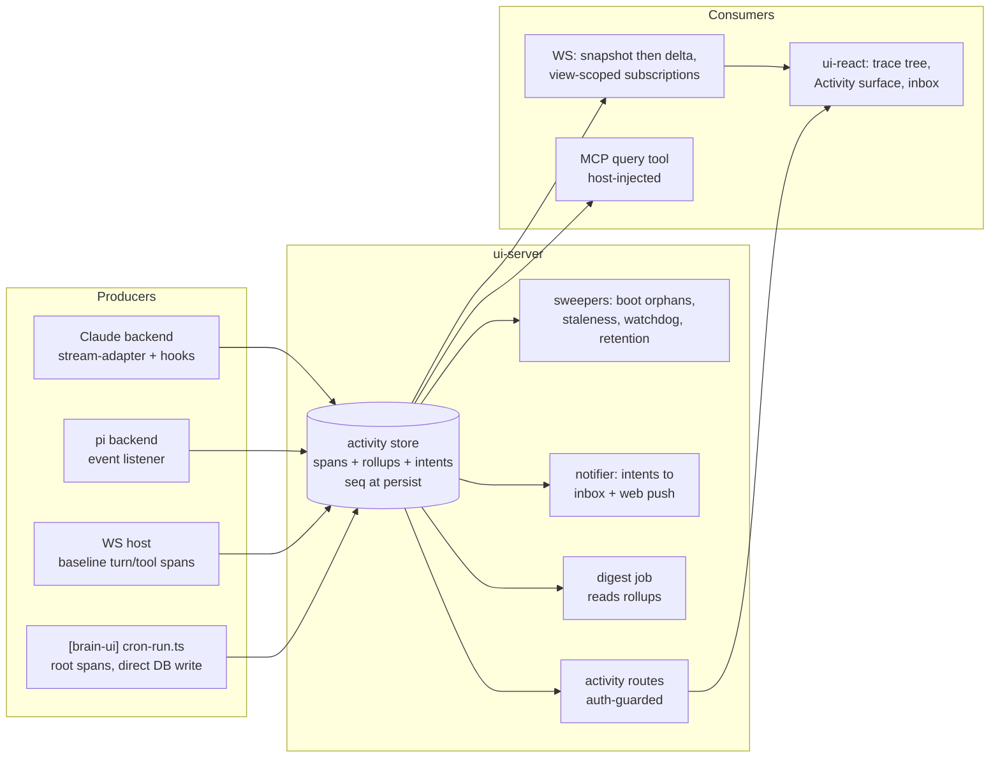

# Decision — the agent observability layer

Why runs, spans and the Activity surface are shaped the way they are. Shipped
in 0.21.0; this is the design record, not a status file.

The implementation-unit list, the phased delivery table and the success metrics
that were in the original plan are gone — the code is the answer to all three
now. What survives is the reasoning a later change has to respect.

One follow-up from this work is still open and tracked in the issue tracker: an
agent-written prose pass over the deterministic digest.
## Summary

Build the observability layer as a new activity module inside `ui-server`'s existing observability seam: an OTel-GenAI-aligned span store in the server SQLite written at span start (persist-then-emit with per-run sequence numbers), streamed to clients through additive protocol frames behind a `server_hello` capability flag, rendered by generalizing the existing tool-call timeline into a reusable trace tree, indexed by a new Activity surface, and completed with an in-app failure inbox + web push, a deterministic digest cron job, and a host-injected MCP query tool.

---

## Problem Frame

The stack runs agents in four shapes (interactive turns, parallel sessions, foreground subagent fan-outs, cron jobs) with almost no visibility; the richest signals are produced and then dropped in flight. Full framing, actors, flows, and acceptance examples live in the origin document. Plan-specific framing: research confirmed the SDK already delivers everything needed (subagent linkage, per-subagent usage, per-model token/cost breakdowns on both backends) — the work is a persistence + protocol + UI read side, not new instrumentation at the model layer.

---

## Scope Boundaries

Carried from origin: no eval/quality scoring; no external observability stack (OTel attribute naming keeps OTLP export open, but no exporter ships); no cost meter in the chat composer; nothing multi-user; subagent views are observation-only.

Plan-local additions:

- No OTel SDK dependency — `@opentelemetry/api` types only, honoring the existing two-package dependency promise in `packages/ui-server/src/observability/`.
- No new "span exporter" seam (ROADMAP seam rule: no seam without a plausible second implementation within a year).
- No changes to how transcripts are stored: SDK JSONL stays the content source of truth; spans are structure/metrics only, linked by session/turn/tool ids.
- Cron-runner retry/circuit-breaker behavior is **unchanged by this plan** — only the notification layer's debounce/dedup/rate-cap (R24) is in scope. The origin flagged this fork explicitly; this is the resolution, not an oversight.

### Deferred to Follow-Up Work

- The `packages/core` span-sink emitting call: core currently runs no agent loop (single-shot completion seam only), so the emitter lands when core gains one; until then the cron-agent-trace acceptance is fixture-verified (see U6).

- Agent-written digest prose (v1 digest is deterministically rendered from rollups; an LLM-polish pass is a later, separately-scoped addition).
- pi-side MCP query tool parity (v1 registers the query tool in the Claude backend; pi gains it when its custom-tool surface is confirmed).
- Deep instrumentation of `brain` core CLI agent steps beyond the JSONL span-sink contract defined in the cron unit (core-repo work rides the same lockstep release but can trail the UI units).

---

## Key Technical Decisions

- **Activity store as a third observability consumer** (`src/activity/` in ui-server, using `@opentelemetry/api` trace vocabulary): keeps the two-dependency promise, reuses the recording-observability test path, no new seam.
- **Write-at-start spans with persist-then-emit and per-run seq** (R21/R23): the store write is the source of truth; WS deltas are derived from committed rows. This is what makes glance-check, late-join, and crash recovery coherent.
- **Cron liveness via direct DB write + two-speed server polling**: the cron wrapper writes spans straight into the shared SQLite (WAL, it already opens the DB). The server runs an **always-on low-frequency tick** (15–30s, shared interval machinery with the staleness sweep and watchdog, which also run unconditionally) that sweeps pending notification intents and foreign terminal writes — this is what makes an *unwatched* failure push fire within a minute — plus a fast poller (1–2s) on the global change cursor that runs only while at least one activity subscription is live, synthesizing live deltas. Chosen over a loopback POST endpoint because it adds no new unauthenticated network surface (fail-closed principle). The boot/staleness sweeper covers the server-was-down case.
- **Backend reporting rides the bridge**: `BackendBridge` gains an optional activity reporter; the host persists and emits. Host-side baseline spans (turn, tool call, timing, outcome — R7) are derived in the ws host from frames it already relays, so pi gets a full activity tree with zero pi-SDK work; backends enrich (usage, models, subagent linkage) through the reporter.
- **`forwardSubagentText: true` in the Claude backend** (confirmed in synthesis): full subagent transcripts for drill-in; subagent tool activity is parent-tagged even without it, so a regression degrades gracefully to activity-only.
- **Tokens on the wire are additive**: the result frame gains an optional usage block (per-model breakdown included); absent cost renders as unknown, never zero (AE3).
- **Subscriptions are view-scoped**: a client declares interest (activity index, a session, a run); `ConnectionState` in `dispatch.ts` holds the subscription set; broadcast of activity deltas is filtered per connection — the first departure from broadcast-everything, deliberately scoped to the new frames only.
- **MCP query tool host-injected like the location tool** (confirmed in synthesis): read-only, auto-allowed by the same strictly-narrower argument as the read-only brain tools; additive contract change documented in `docs/integration-contract.md`.
- **VAPID keypair auto-generated at first boot, private key stored OUTSIDE the generic settings KV path** (dedicated secret-classified storage, never exposed via any settings-list/export route) — today no true secret lives in the DB (password hash and cookie secret are env-only), and a plain-KV private key would let a DB-file leak send authentic push notifications to the user's real device. Push subscriptions in a `push_subscriptions` table modeled on `passkey_credentials` (single-user, per-device rows, pruned on 404/410).
- **Digest is deterministic** (confirmed in synthesis): a cron job through the standard wrapper reads rollups and renders a template; its own run appears in the record but is excluded from "notable" heuristics.
- **Timeline generalization, not duplication**: the trace tree is the existing timeline shell + tool-views registry fed by a new data source (live store state or fetched span trees); subagent drill-in and cron run detail are the same component with different roots.

---

## High-Level Technical Design

> *This illustrates the intended approach and is directional guidance for review, not implementation specification. The implementing agent should treat it as context, not code to reproduce.*

Span lifecycle (write-once terminal): `running → success | error | timeout | cancelled | denied-by-user | interrupted`; parent terminal cascades open children to `cancelled(+reason)`; `interrupted` only from sweepers; `stuck` is a live flag from the watchdog, not an outcome. Notification intents: `pending → sent | send-failed | suppressed`. Push subscriptions: `active → pruned` (410/404) with `pushsubscriptionchange` rotation.

---

## System-Wide Impact

- **Interaction graph:** WS host frame flow (spans derived from it), backend hooks block (span capture beside write locks — ordering within the same PreToolUse matcher list matters), service worker (push beside share-target), cron wrapper (span writes beside `recordCronRun`), settings KV (VAPID, prefs, TZ).
- **Error propagation:** span writes must never fail a turn — activity persistence errors log and drop (observability must not break the observed); the wrapper stays fail-open; push send failures degrade to inbox.
- **State lifecycle risks:** two writers on one SQLite (server + cron wrapper) — and they are NOT fully disjoint (the staleness sweep and watchdog write to cron-owned rows), so all span writes use immediate transactions with busy_timeout and wrapper-side retry (U1); retention pruning batched to avoid starving writers; boot sweeps must be idempotent across rapid restarts.
- **API surface parity:** result-frame usage must render sanely for both backends and for rev-2/no-capability clients (fields optional everywhere); the activity capability flag keeps old clients receiving zero new frames.
- **Integration coverage:** cross-process cron write → live delta; abort mid-fan-out → cascaded cancellation reaching an open subagent view; digest floor vs retention prune.
- **Unchanged invariants:** turn approval flow, turnId echo contract, session parallelism caps, transcripts-as-content-source, broadcast semantics for all pre-existing frames, `/api/health` publicness, auth mount order.

---

## Sources & References

- **Origin:** a requirements pass on 2026-08-24, not kept — this record is what survived it.
- Key code: `packages/ui-server/src/observability/`, `packages/ui-backend-claude/src/stream-adapter.ts`, `packages/ui-sdk/src/protocol.ts`, `packages/ui-react/src/components/chat/tool-call-timeline.tsx`, `[brain-ui]` `server/scripts/cron-run.ts`
- External: OTel GenAI semantic conventions; Claude Agent SDK 0.3.241 typings (`sdk.d.ts`); Web Push/VAPID
