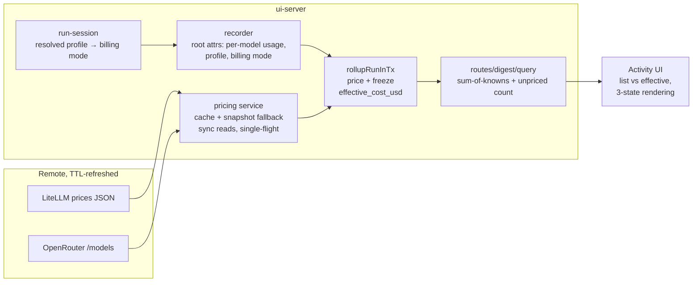

# Decision — dynamic pricing and effective cost

Why a run carries both a list price and an effective cost, and why unknown cost
is never rendered as zero. Shipped in 0.22.0; this is the design record, not a
status file.

Two follow-ups from this work are still open and tracked in the issue tracker:
route-aware price resolution, and exact per-generation accounting for
OpenRouter.
## Summary

Build a TTL-cached, remote-refreshed model-pricing service in `ui-server` (mirroring the model-discovery source shape), classify every run's billing mode from its resolved inference profile, compute a frozen `effective_cost_usd` inside the rollup transaction, and surface dual cost (list vs effective, with explicit unknown counts) through the wire protocol, Activity UI, daily digest, and `query_activity` — while fixing the three existing sites that render unknown cost as $0. Rides along: a minimum detail-retention window so nightly cron runs stay drillable instead of losing their span trees to the morning digest's prune (U7).

---

## Problem Frame

Runs record only backend list-price accounting; subscription-billed work is indistinguishable from real pay-as-you-go spend, and unknown cost already collapses to $0 in three aggregation sites. See origin for the full frame.

---

## Scope Boundaries

- Deepgram voice / image-API spend (not in the span system)
- Exact OpenRouter per-generation accounting (v2; nitro prices flagged estimate in v1)
- Historical rollup backfill (pre-feature rows stay unknown)
- Budget alerts on effective spend
- Long-context / 1h-cache pricing tiers (base rates in v1)

### Deferred to Follow-Up Work

- Provider-route-aware price selection: `resolve()` keys on model id alone; a cross-review noted an id carried by both catalogs would price at OpenRouter's rate even for a non-OpenRouter route. The two key namespaces (bare vs `vendor/model`) are disjoint in practice, so v1 accepts it; plumbing the resolved profile route into resolution is the v2 shape (pairs with exact OpenRouter per-generation accounting).
- brain-ui deployment shell: dependency bump + verifying the cron env allowlist in `scripts/entrypoint.sh` exposes the same credentials the server classifies against — separate PR in the brain-ui repo after release.

---

## Key Technical Decisions

- **Service in `ui-server`, not `ui-backend-claude`**: billing is a deployment property spanning backends and cron; discovery stayed backend-side only because it is Anthropic-credential-bound. (see origin)
- **Freeze-on-first-computation** via COALESCE-preserving upsert of the new columns: re-rollups (sweeps, cascade closes) must not silently reprice history. (origin Key Decisions / AE5)
- **Cron child-sum instead of a sink contract change**: keeps the span-sink JSONL shape stable (it ships first, per its own discipline) and is double-count-safe for cron origins.
- **Backend cost stays authoritative "list"**; the service fills `cost_usd` only when the backend reported none — two disagreeing numbers on one run would be worse than a gap.
- **Billing mode resolves at run start and rides the root span** (attr + profile id): the rollup then reads it locally, keeping `rollupRunInTx` free of registry/service lookups except the pure pricing table read.
- **Aggregates carry `unpricedRuns`**: sum-of-knowns everywhere; the UI and digest render "≥ $X · N unpriced" whenever the count is nonzero.
- **Missing cache rate → whole run unknown**: cache reads dominate Claude usage; partial pricing would systematically understate. (origin AE-relevant decision)

---

## High-Level Technical Design

> *This illustrates the intended approach and is directional guidance for review, not implementation specification. The implementing agent should treat it as context, not code to reproduce.*

Billing mode decision (per run, at start): declared profile with `apiKeyEnv`/`authTokenEnv` → `api`; ambient profile → `subscription` iff OAuth present and no `ANTHROPIC_API_KEY`; settings override wins over both.

---

## System-Wide Impact

- **Interaction graph:** rollup writes now consult the pricing service (pure in-memory read inside the tx); run-session → recorder gains profile/billing pass-through; WS snapshot/delta and REST widen additively — old clients ignore the new optional fields
- **Error propagation:** pricing failures degrade to state, never into the rollup transaction or a request path; a disabled/cold service yields NULL effective cost, which every surface renders as unknown
- **State lifecycle risks:** freeze semantics guard against sweep-driven repricing; the settings override deliberately affects only future rollups (frozen history documented)
- **API surface parity:** query_activity, REST rollups, WS frames, and the digest all gain the same triple — one surface lagging would resurrect the unknown-as-zero bug there
- **Integration coverage:** migration-on-existing-DB, cron-origin classification from server env, and the digest-window-straddling-deploy case are the cross-layer scenarios unit tests alone won't prove
- **Unchanged invariants:** `cost_usd` remains backend-authoritative; the span-sink JSONL contract is untouched; rollup root-span-only aggregation stands (cron child-sum is an origin-scoped exception, not a new rule); rollups still outlive detail forever. Retention changes in exactly one way (U7): the detail-prune predicate gains a minimum-age AND-condition — the digest floor's never-prune-uncovered guarantee and the hard ceiling's independence both stand

---

## Sources & References

- **Origin:** a requirements pass on 2026-08-25, not kept — this record is what survived it.
- Related code: `packages/ui-backend-claude/src/model-discovery.ts`, `packages/ui-server/src/activity/store.ts`, `packages/ui-server/src/activity/recorder.ts`
- Related: [agent-observability.md](agent-observability.md) — the layer this extends.
- External: LiteLLM `model_prices_and_context_window.json` (raw.githubusercontent.com/BerriAI/litellm/main/…), OpenRouter `GET /api/v1/models`
