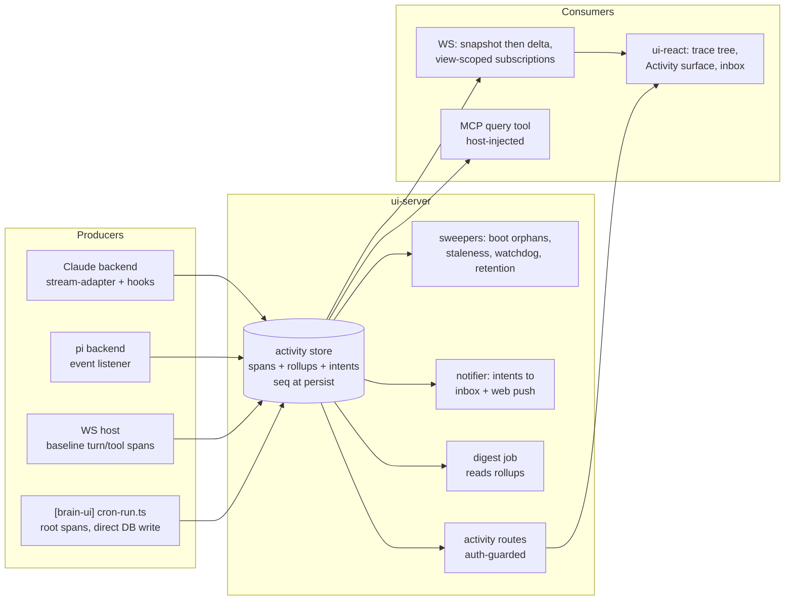

# feat: Agent observability layer

**Target repos:** brain-kit (primary — all app behavior) and brain-ui (shell wiring only: service worker, crontab, env plumbing). Paths are repo-relative to brain-kit unless prefixed `[brain-ui]`.

## Summary

Build the observability layer as a new activity module inside `ui-server`'s existing observability seam: an OTel-GenAI-aligned span store in the server SQLite written at span start (persist-then-emit with per-run sequence numbers), streamed to clients through additive protocol frames behind a `server_hello` capability flag, rendered by generalizing the existing tool-call timeline into a reusable trace tree, indexed by a new Activity surface, and completed with an in-app failure inbox + web push, a deterministic digest cron job, and a host-injected MCP query tool.

---

## Problem Frame

The stack runs agents in four shapes (interactive turns, parallel sessions, foreground subagent fan-outs, cron jobs) with almost no visibility; the richest signals are produced and then dropped in flight. Full framing, actors, flows, and acceptance examples live in the origin document. Plan-specific framing: research confirmed the SDK already delivers everything needed (subagent linkage, per-subagent usage, per-model token/cost breakdowns on both backends) — the work is a persistence + protocol + UI read side, not new instrumentation at the model layer.

---

## Requirements

Origin requirements R1–R20 carry forward unchanged (see origin: `docs/brainstorms/2026-08-24-agent-observability-requirements.md`). Flow analysis during planning promoted these additional requirements, confirmed via the pre-write synthesis:

- R21. Spans are written at start (non-terminal row exists while running) and updated to a write-once terminal outcome. The outcome taxonomy gains a sixth member, `interrupted`, assigned only by a sweeper: on boot the server closes its own orphaned non-terminal spans; a staleness sweep closes non-terminal spans from dead external writers (reusing the "cron_runs stuck in running is a signal" convention). A parent reaching a terminal state cascade-closes open children as `cancelled` with a reason attribute.
- R22. A watchdog surfaces runs exceeding a duration threshold (global default, per-job override) as *stuck* — a live signal and notification trigger, not a terminal outcome.
- R23. Ordering primitive for AE6: a delta is emitted only after its store write commits; sequence numbers are per-run, monotonic, assigned at persist time; snapshots carry the high-water sequence and clients discard deltas at or below it. Subscribing to an already-terminal run returns snapshot only.
- R24. Notification delivery is at-least-once: a notification intent is persisted with the triggering event (pending → sent | send-failed | suppressed), swept on boot, deduplicated by run tag, debounced per job, and rate-capped globally (failure-storm safety). "Unwatched" is defined as: no live view-scoped subscription to that session/run existed when the failure was recorded.
- R25. The in-app failure inbox is the guaranteed notification tier; web push is the accelerator. Push permission denial, missing subscriptions, or send failure degrade to inbox-only, never to silence.
- R26. Retention, digest, and deep links are coordinated: full-detail spans are pruned only after the digest has covered them; rollups keep per-run identity, outcome, duration, cost, and failure reason forever, so any run ID that ever existed resolves to at least a rollup-level detail page ("detail pruned"), and only never-existed IDs 404.
- R27. Tool-call spans record approval-wait and execution time separately (a denied-by-user span has only wait time). Day-boundary for rollups is a configurable timezone stored server-side (cron runs in UTC; the user does not).

**Origin actors:** A1 (user/operator), A2 (agent backends), A3 (scheduled jobs), A4 (agent as consumer).
**Origin flows:** F1 (glance-check), F2 (subagent drill-in), F3 (background failure), F4 (while-you-were-away), F5 (agent introspection).
**Origin acceptance examples:** AE1 (denied outcome), AE2 (timing survives reload), AE3 (pi tokens, unknown cost), AE4 (subagent drill-in), AE5 (failure push), AE6 (snapshot-then-delta), AE7 (cron agent trace).

---

## Scope Boundaries

Carried from origin: no eval/quality scoring; no external observability stack (OTel attribute naming keeps OTLP export open, but no exporter ships); no cost meter in the chat composer; nothing multi-user; subagent views are observation-only.

Plan-local additions:

- No OTel SDK dependency — `@opentelemetry/api` types only, honoring the existing two-package dependency promise in `packages/ui-server/src/observability/`.
- No new "span exporter" seam (ROADMAP seam rule: no seam without a plausible second implementation within a year).
- No changes to how transcripts are stored: SDK JSONL stays the content source of truth; spans are structure/metrics only, linked by session/turn/tool ids.
- Cron-runner retry/circuit-breaker behavior is **unchanged by this plan** — only the notification layer's debounce/dedup/rate-cap (R24) is in scope. The origin flagged this fork explicitly; this is the resolution, not an oversight.

### Deferred to Follow-Up Work

- The `packages/core` span-sink emitting call: core currently runs no agent loop (single-shot completion seam only), so the emitter lands when core gains one; until then the cron-agent-trace acceptance is fixture-verified (see U6).

- Agent-written digest prose (v1 digest is deterministically rendered from rollups; an LLM-polish pass is a later, separately-scoped addition).
- pi-side MCP query tool parity (v1 registers the query tool in the Claude backend; pi gains it when its custom-tool surface is confirmed).
- Deep instrumentation of `brain` core CLI agent steps beyond the JSONL span-sink contract defined in the cron unit (core-repo work rides the same lockstep release but can trail the UI units).

---

## Context & Research

### Relevant Code and Patterns

- `packages/ui-server/src/observability/` — the OTel-API-shaped facade (`index.ts`, `loggers.ts`, `meter.ts`); the activity store is a third consumer here. `createRecordingObservability()` is the test pattern.
- `packages/ui-server/migrations/` — numbered SQL migrations run by `runMigrations` in `src/db/client.ts`; `001_initial.sql` (`cron_runs` + composite DESC index) and `005_passkey_credentials.sql` (per-device table, single-user) are the schema models; `006_settings.sql` KV for preferences/VAPID.
- `packages/ui-sdk/src/protocol.ts` + `src/schemas.ts` — additive frame policy (no rev bump), `client_hello`/`server_hello` capability flags, both zod unions need new entries.
- `packages/ui-server/src/ws/` — `dispatch.ts` (`ConnectionState`, turnId echo verification), `clients.ts` (`ClientSet.broadcast`, `shrinkForReplication`), `turns.ts` (pending maps), chunked `session_history` replay as the snapshot precedent.
- `packages/ui-backend-claude/src/stream-adapter.ts` — the flattening point; `backend.ts` hooks block (~line 691+: write locks, Agent foreground rewrite, PermissionDenied release), `location-tool.ts` + `ask-user-tool.ts` (`createBrainUiMcpServer`) — the MCP tool pattern.
- `packages/ui-backend-pi/src/backend.ts` — `snapshotCost()`/`turnCost()`; `AgentEvent` stream carries `AssistantMessage.usage` (full token/cost breakdown) today.
- `packages/ui-react/src/components/chat/tool-call-timeline.tsx` + `tool-views.tsx` (shell/registry split), `src/stores/*-store.ts` (zustand + `registerDevHandle`), `session-drawer.tsx` and `files/*` (list→detail surface models), `src/hooks/use-websocket.ts` (single frame switch).
- `[brain-ui]` `client/src/app.tsx` (hash routes, ActiveView), `client/src/sw/service-worker.ts` (`registerShareTarget` packaging model for `registerPushHandlers`), `scripts/entrypoint.sh` (`generate_crontab`, cron env allowlist), `server/scripts/cron-run.ts` (wrapper, `recordCronRun`, fail-open DB).

### Institutional Learnings

- No `docs/solutions/` archive. Binding constraints: activity record in ui-server SQLite (never `brain.db`); MCP tool names and CLI `--json` are versioned contract (`docs/integration-contract.md`, `CONTRACT:` commit); all new routes behind the auth guard (mount-order boundary in `src/app.ts`); no daemons; changeset per touched package; `bun run api-report` after export changes; env vars need env-parity updates; leakage gate (no personal data, "Alex Example" fixtures); `bun run test`, never bare `bun test`.
- Protocol rev 3: turnId echo is mandatory per-connection for pending-resolving frames — new interactive frames must register with the TurnCoordinator and pass `turnIdMatches`.
- 0.18.0: per-turn `query()` subprocess; Agent tool forced foreground via PreToolUse `updatedInput`; keyed write locks ride the same hooks; 30-min turn cap.

### External References

- OTel GenAI semantic conventions (span names/attributes: `invoke_agent`, `execute_tool`, `gen_ai.usage.*`) — adopt attribute names, not the SDK.
- Claude Agent SDK 0.3.241 typings: `parent_tool_use_id` on assistant/stream/tool_progress/user messages; `SDKTaskStartedMessage`/`TaskProgress` (per-subagent `usage`, `spawn_depth`, `is_backgrounded`); `Options.forwardSubagentText`; result `modelUsage` ("prefer for accounting", cumulative in streaming sessions — read latest, never sum) and `permission_denials`.
- Web Push / VAPID standard flow; GitHub-Actions run-list→run-detail as the scheduled-run UX reference.

---

## Key Technical Decisions

- **Activity store as a third observability consumer** (`src/activity/` in ui-server, using `@opentelemetry/api` trace vocabulary): keeps the two-dependency promise, reuses the recording-observability test path, no new seam.
- **Write-at-start spans with persist-then-emit and per-run seq** (R21/R23): the store write is the source of truth; WS deltas are derived from committed rows. This is what makes glance-check, late-join, and crash recovery coherent.
- **Cron liveness via direct DB write + two-speed server polling**: the cron wrapper writes spans straight into the shared SQLite (WAL, it already opens the DB). The server runs an **always-on low-frequency tick** (15–30s, shared interval machinery with the staleness sweep and watchdog, which also run unconditionally) that sweeps pending notification intents and foreign terminal writes — this is what makes an *unwatched* failure push fire within a minute — plus a fast poller (1–2s) on the global change cursor that runs only while at least one activity subscription is live, synthesizing live deltas. Chosen over a loopback POST endpoint because it adds no new unauthenticated network surface (fail-closed principle). The boot/staleness sweeper covers the server-was-down case.
- **Backend reporting rides the bridge**: `BackendBridge` gains an optional activity reporter; the host persists and emits. Host-side baseline spans (turn, tool call, timing, outcome — R7) are derived in the ws host from frames it already relays, so pi gets a full activity tree with zero pi-SDK work; backends enrich (usage, models, subagent linkage) through the reporter.
- **`forwardSubagentText: true` in the Claude backend** (confirmed in synthesis): full subagent transcripts for drill-in; subagent tool activity is parent-tagged even without it, so a regression degrades gracefully to activity-only.
- **Tokens on the wire are additive**: the result frame gains an optional usage block (per-model breakdown included); absent cost renders as unknown, never zero (AE3).
- **Subscriptions are view-scoped**: a client declares interest (activity index, a session, a run); `ConnectionState` in `dispatch.ts` holds the subscription set; broadcast of activity deltas is filtered per connection — the first departure from broadcast-everything, deliberately scoped to the new frames only.
- **MCP query tool host-injected like the location tool** (confirmed in synthesis): read-only, auto-allowed by the same strictly-narrower argument as the read-only brain tools; additive contract change documented in `docs/integration-contract.md`.
- **VAPID keypair auto-generated at first boot, private key stored OUTSIDE the generic settings KV path** (dedicated secret-classified storage, never exposed via any settings-list/export route) — today no true secret lives in the DB (password hash and cookie secret are env-only), and a plain-KV private key would let a DB-file leak send authentic push notifications to the user's real device. Push subscriptions in a `push_subscriptions` table modeled on `passkey_credentials` (single-user, per-device rows, pruned on 404/410).
- **Digest is deterministic** (confirmed in synthesis): a cron job through the standard wrapper reads rollups and renders a template; its own run appears in the record but is excluded from "notable" heuristics.
- **Timeline generalization, not duplication**: the trace tree is the existing timeline shell + tool-views registry fed by a new data source (live store state or fetched span trees); subagent drill-in and cron run detail are the same component with different roots.

---

## Open Questions

### Resolved During Planning

- Subagent linkage under foreground execution: SDK typings gate `parent_tool_use_id` on "produced inside a subagent", never on backgrounding; the 0.18.0 foreground rewrite is a PreToolUse input rewrite, orthogonal to stream tagging. High confidence; a smoke test is the first act of the backend unit.
- pi token availability: full `Usage` (input/output/cacheRead/cacheWrite + cost breakdown) rides `message_end`/`turn_end` events already subscribed to; `getSessionStats()` adds session totals. R6 is plumbing.
- Query tool surface: MCP tool, not a `brain` CLI subcommand — the activity DB belongs to ui-server, and "CLI executes" applies to brain-repo state, which this is not.
- Where subagent transcripts persist for historical drill-in: span rows store tool activity and (with forwarding on) text block summaries as span events; the historical subagent view renders from spans, not from SDK JSONL, so it works even where the SDK keeps no per-subagent session file. Degraded "activity only, transcript not captured" state covers forwarding-off history and pi.

### Resolve During Implementation (user input needed)

- [Affects U9][User decision] Mobile navigation placement for the Activity surface and inbox badge (tab-bar slot vs "More" overflow vs another affordance).
- [Affects U12][User decision] Digest presentation on app open: proactive banner/card vs passive discovery on the Activity surface.
- [Affects U8][User decision] Where approval requests originating inside a subagent render, given drill-in views are observation-only.

### Deferred to Implementation

- Exact span attribute set beyond the OTel GenAI core (start from `gen_ai.operation.name`, `gen_ai.request.model`, `gen_ai.usage.input_tokens`/`output_tokens` + cache attrs; extend as rendering needs emerge).
- Snapshot chunking thresholds for very large runs (reuse `HISTORY_CHUNK_BYTES` machinery; tune against real fan-outs).
- The `brain` core span-sink details for agent-running cron steps (JSONL contract is defined in U6; which core call sites emit it is discovered in the core codebase during implementation).
- Watchdog default threshold values and per-job override syntax (settings KV; tune after first weeks of real runs).
- Whether nested (depth ≥ 2) subagents need adapter changes or arrive pre-linked (`spawn_depth` exists on task messages; verify empirically in U3).

---

## High-Level Technical Design

> *This illustrates the intended approach and is directional guidance for review, not implementation specification. The implementing agent should treat it as context, not code to reproduce.*

Span lifecycle (write-once terminal): `running → success | error | timeout | cancelled | denied-by-user | interrupted`; parent terminal cascades open children to `cancelled(+reason)`; `interrupted` only from sweepers; `stuck` is a live flag from the watchdog, not an outcome. Notification intents: `pending → sent | send-failed | suppressed`. Push subscriptions: `active → pruned` (410/404) with `pushsubscriptionchange` rotation.

---

## Implementation Units

Phase A (record and wire): U1–U6. Phase B (read surfaces): U7–U9. Phase C (notify, digest, agent access): U10–U13. U14 closes contract/docs/release mechanics.

### U1. Activity store and lifecycle sweepers (ui-server)

**Goal:** The canonical span record: schema, write-at-start API, seq assignment, outcome taxonomy, sweepers, rollups, retention.

**Requirements:** R1, R2, R3, R5, R20, R21, R22, R23 (store side), R26, R27.

**Dependencies:** None.

**Files:**
- Create: `packages/ui-server/migrations/007_activity.sql` (spans, span rollups, notification intents), `packages/ui-server/src/activity/store.ts`, `packages/ui-server/src/activity/sweep.ts`, `packages/ui-server/src/activity/rollups.ts`
- Modify: `packages/ui-server/src/app.ts` (construct + thread)
- Test: `packages/ui-server/tests/activity-store.test.ts`, `packages/ui-server/tests/activity-sweep.test.ts`

**Approach:**
- Span rows follow the OTel span shape (trace/run id, span id, parent id, name, kind/origin, OTel-named attrs as JSON, start/end, outcome, seq); per-run monotonic seq assigned inside the insert/update transaction.
- Every span insert/update runs under `BEGIN IMMEDIATE` (bun:sqlite `transaction(...).immediate`) and both handles (server and cron wrapper) set `PRAGMA busy_timeout` (~5000ms) in `createUiDb`; the wrapper retries on SQLITE_BUSY rather than dropping the write — a deferred transaction from two writers throws SQLITE_BUSY and a dropped terminal write would falsely close the run as interrupted later.
- A global monotonic change cursor (single change-log rowid or global write counter stamped on every span write) exists alongside per-run seq: the cursor is the poller's discovery primitive (a brand-new foreign run is invisible to per-run high-water comparisons); per-run seq remains the client-facing ordering primitive only.
- Separate wait vs execution timestamps on tool-call spans (R27).
- Boot sweep closes this server's orphans as `interrupted`. The staleness sweep is keyed on **heartbeat age, not span age**: external writers touch a `last_heartbeat_at` on their root span (~30s) while alive, so a legitimately long quiet run is never force-closed while a dead writer is detected promptly. Watchdog flags (not closes) over-threshold live runs.
- Retention prunes full-detail spans older than the digest floor in batched transactions, upserting rollup rows that keep run identity, outcome, duration, cost, failure reason. A **hard retention ceiling independent of the digest floor** (default ~90 days) prunes regardless, marking the digest coverage gap, and an alert fires when the floor lags the ceiling minus a margin — a silently dead digest job must not freeze pruning forever.
- **Rollup aggregation scope: root spans only** (turn spans and cron root spans). Subagent-span usage is display-only enrichment, excluded from rollup sums — the SDK's result-level `modelUsage` already includes subagent consumption, so summing all spans would double-count every fan-out.
- Writer identity (process stamp) on spans so sweepers distinguish own vs foreign rows.

**Patterns to follow:** `recordCronRun` + `cron_runs` schema; `createUiDb` migration flow; index style from `001_initial.sql`.

**Test scenarios:**
- Happy path: open turn span → child tool span → terminal update; tree query returns ordered spans with correct seq.
- Happy path: rollup computation aggregates cost/tokens per day (configured TZ boundary), session, job.
- Edge case: terminal state is write-once — second terminal update is rejected/ignored.
- Edge case: parent terminal cascades open children to cancelled with reason.
- Error path: boot sweep marks own orphans interrupted; staleness sweep closes stale foreign rows; fresh foreign running rows untouched.
- Covers AE2 (persistence side): reopening a stored run returns identical timings/outcomes.
- Edge case: retention prune of a covered window leaves rollups resolvable by run id; never prunes past the digest floor.
- Integration: two DB handles (simulating cron writer + server) interleave writes without seq collision per run.

**Verification:** Store tests green; migration applies cleanly on an existing 006-level DB; `cron_runs` continues to work unchanged.

---

### U2. Protocol and schema additions (ui-sdk)

**Goal:** The wire vocabulary: usage on results, activity subscription/snapshot/delta frames, capability flag.

**Requirements:** R4, R6 (wire slot), R19, R23 (frame side).

**Dependencies:** None (parallel with U1).

**Files:**
- Modify: `packages/ui-sdk/src/protocol.ts`, `packages/ui-sdk/src/schemas.ts`
- Test: `packages/ui-sdk/tests/schemas.test.ts` (extend)

**Approach:**
- Additive only — no `PROTOCOL_REV` bump; document each frame "(rev 3, additive)".
- Result frame gains an optional usage block: totals plus per-model breakdown (tokens incl. cache read/creation, cost-where-priced).
- Client frames: activity subscribe/unsubscribe carrying a view scope (index | session | run). Server frames: activity snapshot (chunkable, carries high-water seq) and activity delta. **Deltas are append-only increments, not whole-span upserts**: new span events carry a per-span event index, span-row field changes ride field patches — a transcript-bearing span must never resend its grown event list (quadratic bytes on chatty fan-outs, and one frame over the 512KB shrink cap gets lossily mangled and sticks until re-snapshot). Individual transcript events are capped at persist time with an explicit stored truncation marker so no single delta can approach `MAX_WS_MESSAGE_BYTES`. Subagent linkage fields (parent tool-use id, depth) added to tool frames as optional.
- `server_hello`/`client_hello` capabilities advertise the activity stream; absence means the server never sends activity frames.

**Patterns to follow:** rev-2/3 additive annotations in `protocol.ts`; discriminated-union entries in both zod unions; `session_history` chunking flags.

**Test scenarios:**
- Happy path: new frames round-trip through parse/serialize in both unions.
- Edge case: unknown-key preservation on the new frames (contract rule).
- Error path: malformed activity subscribe rejected by `parseClientMessage` with the standard error frame path, counted as dropped.

**Verification:** Schema tests green; `bun run api-report` reflects the additions; `docs/integration-contract.md` WS section updated in the same commit.

---

### U3. Claude backend telemetry capture (ui-backend-claude)

**Goal:** Stop dropping SDK telemetry: usage, denials, error subtypes, subagent linkage, task lifecycle, full subagent transcripts.

**Requirements:** R4, R6, R7 (enrichment side), R8 (data), AE1, AE3, AE4 (data side).

**Dependencies:** U2 (frame slots), U1 (span vocabulary via bridge reporter — interface only).

**Files:**
- Modify: `packages/ui-backend-claude/src/stream-adapter.ts`, `packages/ui-backend-claude/src/backend.ts`, `packages/ui-sdk/src/server/backend.ts` (optional bridge activity reporter)
- Test: `packages/ui-backend-claude/tests/stream-adapter.test.ts` (extend)

**Approach:**
- Result handling reads `modelUsage` (per SDK guidance: cumulative in streaming sessions — latest wins, never summed), `usage`, `permission_denials`, and preserves error subtypes into the outcome taxonomy.
- `system` case gains task_started/task_progress/task_updated handling → subagent span events (status, per-subagent usage, spawn depth, retry attempts as sibling spans) through the bridge reporter; tool frames carry parent linkage.
- Set `forwardSubagentText: true`; forwarded assistant/user messages tagged with a parent become subagent transcript events, not top-level chat frames.
- Hook points (`PreToolUse`/`PostToolUse`/`PostToolUseFailure`/`SubagentStart`/`SubagentStop`) supply approval-wait vs execution timestamps and denied outcomes alongside the existing lock hooks — same hooks block, additive.

**Execution note:** Start with a live smoke test of a foreground Agent fan-out to confirm parent tagging and task-message flow before wiring the adapter (the one flagged uncertainty). The same smoke test must empirically confirm that result-level `modelUsage` includes subagent consumption — the rollup root-spans-only aggregation rule in U1 depends on it (if wrong, root-only aggregation would undercount instead).

**Patterns to follow:** existing adapter case structure; hook wiring at the Agent-rewrite block; result dedup in the stream loop.

**Test scenarios:**
- Happy path: fixture SDK result with modelUsage → result frame usage block with per-model breakdown; cost present.
- Happy path: parent-tagged tool_use/tool_result fixture stream → tool frames with parent linkage + subagent span events.
- Edge case: streaming-session second result carries cumulative modelUsage — adapter reports latest, not sum.
- Edge case: subagent retry fixture → sibling attempt spans, not overwrites.
- Error path: `error_max_turns` subtype maps to timeout-flavored outcome, not generic error; permission_denials produce denied-by-user span data (covers AE1 data path).
- Edge case: forwarding disabled (regression) → activity-only subagent spans, no transcript events, nothing crashes.

**Verification:** Adapter tests green; a real fan-out turn produces a nested span tree in the store via U5.

---

### U4. pi backend usage reporting (ui-backend-pi)

**Goal:** Token usage (and existing cost) flow from the pi event stream into result frames and spans.

**Requirements:** R6, AE3.

**Dependencies:** U2.

**Files:**
- Modify: `packages/ui-backend-pi/src/backend.ts`
- Test: `packages/ui-backend-pi/tests/backend.test.ts` (extend)

**Approach:** Accumulate `AssistantMessage.usage` from message/turn events per turn; report tokens always, cost via the existing `turnCost()` diff (undefined stays unknown — AE3). Feed the bridge reporter with turn-level enrichment; baseline spans come from the host (U5), so no pi-side span tree work.

**Patterns to follow:** `snapshotCost`/`turnCost` discipline (undefined over zero).

**Test scenarios:**
- Happy path: fixture events with usage → result frame tokens populated.
- Edge case: missing cost snapshot → cost absent, tokens present (covers AE3).
- Edge case: multiple messages per turn accumulate correctly.

**Verification:** pi turn in dev shows tokens in the UI with cost "unknown" when unpriced.

---

### U5. Host span emission and live activity streaming (ui-server ws)

**Goal:** The write path meets the wire: baseline spans derived host-side, persist-then-emit, view-scoped subscriptions, snapshot-then-delta, cron-writer polling.

**Requirements:** R1, R5, R7, R19, R23, AE6; cron liveness half of R11.

**Dependencies:** U1, U2; U3/U4 enrich but are not blockers.

**Files:**
- Modify: `packages/ui-server/src/ws/host.ts`, `packages/ui-server/src/ws/run-session.ts`, `packages/ui-server/src/ws/dispatch.ts`, `packages/ui-server/src/ws/clients.ts`
- Create: `packages/ui-server/src/activity/stream.ts` (subscription registry + foreign-write poller)
- Test: `packages/ui-server/tests/ws-activity.test.ts`

**Approach:**
- Turn/tool lifecycle already visible to the host (frames it relays + turn coordinator events) becomes baseline span writes; bridge reporter events merge enrichment onto the same spans.
- **Terminal-write precedence:** the bridge delivers reporter events on the same ordered channel as frames — enrichment for a turn is guaranteed to drain before the host processes that turn's result frame — and the host writes a span's terminal state exactly once, after merging any reporter-supplied outcome. Frame-derived outcome is the fallback, never a competing writer; without this, write-once would reject the accurate denied-by-user/timeout outcomes arriving late.
- Emit deltas only after commit; deltas are append-only increments per U2; snapshot handler queries the store, chunks like session history, stamps high-water seq. The fast poller's baseline is pinned to the snapshot's high-water read inside the same transaction (no gap window between snapshot and first delta).
- Subscription set lives on `ConnectionState`; activity frames are filtered per connection (all other frames keep broadcast semantics untouched). Opening a chat session establishes an implicit session-scoped activity subscription — the timeline's live per-subagent rows depend on it.
- Fast foreign-write poller (1–2s, on the global change cursor) runs only while subscriptions exist; the always-on 15–30s tick (see Key Technical Decisions) handles intents and terminal states regardless. Synthesized foreign deltas reuse the writer-assigned seq values verbatim so the client discard rule holds across snapshot sources.
- Approval re-stamp semantics: wait/execution split recorded server-side (R27), replacing reliance on client stamping.

**Patterns to follow:** `sendSessionHistory` chunked replay; `shrinkForReplication` caps; turnId discipline from `dispatch.ts` for the subscribe frames (session-scoped, not turn-scoped — no pending-map entry needed, but validated like other session frames).

**Test scenarios:**
- Happy path: turn with tool calls → span tree persisted; subscribed client receives ordered deltas.
- Covers AE6: subscribe mid-run → snapshot with high-water seq, then deltas; injected duplicate below high-water is discarded client-side (client half asserted in U8, server emits correct seq here).
- Edge case: subscribe to terminal run → snapshot only, no stream, no error.
- Edge case: unsubscribed connections receive no activity frames; other frames unaffected.
- Integration: row written by a second DB handle (cron simulation) surfaces as a delta while a subscription is live; no polling occurs with zero subscriptions.
- Error path: turn abort mid-fan-out → children cancelled, deltas delivered to open subscribers.

**Verification:** `ws-activity` tests green through `createRecordingObservability` paths; live dev session shows spans appearing in SQLite as a turn runs.

---

### U6. Cron integration and agent-job traces (ui-server + [brain-ui])

**Goal:** Scheduled runs become first-class activity: root spans from the wrapper, agent-step traces via a span sink, the cron-status name gap closed.

**Requirements:** R13 (data side), R15, R21 (foreign writer), AE7.

**Dependencies:** U1.

**Files:**
- Modify: `[brain-ui]` `server/scripts/cron-run.ts`, `[brain-ui]` `scripts/entrypoint.sh` (env allowlist), `[brain-ui]` `.env.example` + brain-kit `.env.example` (span-sink path var, env-parity), `packages/ui-server/src/cron/scheduler.ts` (status reads distinct job names from `cron_runs`/spans)
- Create: span-sink ingest in `packages/ui-server/src/activity/` (JSONL contract)
- Test: `packages/ui-server/tests/cron-activity.test.ts`

**Approach:**
- Wrapper opens the ui DB (it already does), writes a root span at start (write-at-start makes the run visible live via U5's poller), heartbeats `last_heartbeat_at` on the root span (~30s) while the child process lives, terminal on exit; keeps `recordCronRun` in lockstep so nothing existing breaks.
- Agent-running jobs: wrapper exports a span-sink path env var; agent steps append span JSONL; wrapper ingests periodically (liveness) and at exit (completeness). Jobs without agent steps just have the root span (name + elapsed — the degraded F1 state). **Verified during review: `packages/core` currently runs NO agent loop** (its LLM seam is single-shot completion) — this unit ships the JSONL contract and wrapper ingest, fixture-verified (AE7 as a fixture-level acceptance); the core emitting call is Deferred to Follow-Up Work until core gains an agent loop.
- `getCronStatus` switches from the hardcoded two-job array to distinct recorded job names.

**Execution note:** Characterize current `cron-run.ts` behavior (fail-open DB, stderr tail) with a test before modifying — it runs unattended in production.

**Test scenarios:**
- Happy path: wrapped command success → root span success with duration; failure → error with stderr-tail attribute.
- Covers AE7: fixture JSONL sink ingested → child spans (tool calls, usage) under the cron root.
- Edge case: DB unavailable → wrapper stays fail-open, job still runs, exit code preserved.
- Edge case: kill wrapper mid-run → non-terminal row; staleness sweep (U1) closes it interrupted.
- Happy path: status reporting includes module job names present in the record.

**Verification:** A manual `triggerJob` and a wrapped CLI run both produce spans; the name gap test (job invisible before, visible now) passes.

---

### U7. Activity read API (ui-server)

**Goal:** Auth-guarded query surface: run lists, span trees, rollups; sessions read the accounting they already write.

**Requirements:** R5, R11 (data), R13 (API), R14, R26 (resolution rules).

**Dependencies:** U1.

**Files:**
- Create: `packages/ui-server/src/routes/activity.ts`
- Modify: `packages/ui-server/src/app.ts` (mount behind guard), `packages/ui-server/src/routes/sessions.ts` (merge stored cost/turn counts into listings)
- Test: `packages/ui-server/tests/routes-activity.test.ts`

**Approach:** List endpoint (filter by origin kind, job, session, status; paginated, newest first); detail endpoint returns the span tree or the rollup placeholder for pruned runs (R26 — never-existed ids 404, pruned ids resolve); rollup endpoints per day (configured TZ)/session/job. Sessions listing merges `sessions.total_cost_usd`/`num_turns` so the drawer's `> 0` render finally fires on the Claude backend.

**Patterns to follow:** `create<Domain>Routes(deps)` shape from `routes/sessions.ts`; zod body validation per `routes/render.ts`; mount-order auth boundary.

**Test scenarios:**
- Happy path: list filters and pagination; detail returns ordered tree.
- Edge case: pruned run id → rollup-level response flagged "detail pruned"; unknown id → 404.
- Happy path: sessions listing carries stored cost (regression: no longer hardcoded zero).
- Error path: unauthenticated request refused by the guard (mount-order test).

**Verification:** Route tests green; `curl` against dev server shows real turn data.

---

### U8. Trace tree, subagent drill-in, and server timings (ui-react)

**Goal:** The client read side: activity store, frame handling, timeline generalized to a trace tree, subagent drill-in, durations that survive reload.

**Requirements:** R5 (display), R8, R9, R10, R19 (client half), AE2, AE4, AE6 (client half), F2.

**Dependencies:** U2, U5, U7.

**Files:**
- Create: `packages/ui-react/src/stores/activity-store.ts`, `packages/ui-react/src/components/chat/subagent-view.tsx`
- Modify: `packages/ui-react/src/hooks/use-websocket.ts`, `packages/ui-react/src/components/chat/tool-call-timeline.tsx`, `packages/ui-react/src/components/chat/tool-views.tsx`, `packages/ui-react/src/stores/chat-store.ts`
- Test: `packages/ui-react/tests/activity-store.test.ts`, `packages/ui-react/tests/tool-views.test.ts` (extend)

**Approach:**
- activity-store: subscription state, snapshot/delta merge with seq discard rule, `registerDevHandle` for fixture-driven verification.
- Agent tool-call entry renders per-subagent rows (status, current tool, elapsed, tokens from task-progress data); tap opens `subagent-view` — the timeline shell with a span-backed data source, breadcrumb back, recursion for nested subagents, observation-only (no composer), degraded "activity only, transcript not captured" state.
- History-loaded messages read durations/outcomes from span data (via U7 detail fetch or history merge) — duration badges survive reload (AE2). **One clock for both views:** when the activity capability is negotiated, live duration badges also read from server-stamped span deltas (same source as history) — client stamps remain only as the fallback for capability-less connections. AE2's identical-timings claim is asserted live-vs-reload on span data.
- Result frame usage lands in chat/session state for per-turn display hooks (consumed fully in U9).
- **Design decision to resolve before this unit (user input):** where an approval request originating *inside* a subagent renders — the drill-in view is observation-only, but a gated tool call in a fan-out must be grantable somewhere or the parent turn stalls unaddressably.

**Patterns to follow:** shell/registry split (content changes go in tool-views, not the timeline); zustand store conventions; single frame-switch extension in use-websocket.

**Test scenarios:**
- Covers AE6 (client): delta with seq ≤ snapshot high-water discarded; post-snapshot deltas applied in order.
- Covers AE4: fixture fan-out → three subagent rows with live status; opening one renders its own tree; breadcrumb returns.
- Covers AE2: history-loaded message renders duration badge from span data.
- Edge case: subagent view of an aborted parent receives terminal cancelled state, stops spinning.
- Edge case: transcript-absent subagent shows the degraded state, not an empty error.

**Verification:** Store tests green; `__chatStore`/dev-handle fixture walkthrough of drill-in on `bun run dev` (service worker not required).

---

### U9. Activity surface (ui-react + [brain-ui] shell)

**Goal:** The index: global run list (live + history), run detail, rollups, deep links into residence views.

**Requirements:** R11, R12, R13 (UI), R14, R26 (deep-link UX), F1.

**Dependencies:** U7, U8.

**Files:**
- Create: `packages/ui-react/src/activity/activity-page.tsx` (+ list/detail/rollup components)
- Modify: `packages/ui-react/src/stores/ui-store.ts` (ActiveView), `packages/ui-react/src/components/layout/side-rail.tsx`, `[brain-ui]` `client/src/app.tsx` (hash route)
- Test: `packages/ui-react/tests/activity-store.test.ts` (selectors), fixture walkthrough

**Approach:** ActiveView gains `activity`; side-rail entry; hash route `#/activity` (+ per-run deep-link path). **Design decision to resolve before this unit (user input):** mobile placement — the mobile tab bar has a fixed 5-icon layout (Chat, New chat, Graph, Files, More) and the phone glance-check is the headline flow; Activity (and its inbox badge) must not be buried in the "More" overflow without a conscious choice. List groups live runs first (status, origin icon, current step or name+elapsed for span-only runs, cost/tokens), then history GitHub-Actions-style per job/session, failures highlighted. Rows deep-link: session rows into chat (anchored to session + turn + tool entry), subagent rows into the drill-in view, cron rows into a chat-less run detail (same trace component). Rollup cards (today/week, per job, per session) from U7 endpoints — the only cost surface, per origin's no-composer-meter boundary. Pruned deep link renders the rollup placeholder.

**Patterns to follow:** graph view's ActiveView integration (chat stays mounted-hidden); session-drawer list conventions; file-panel index→detail split.

**Test scenarios:**
- Happy path: selector tests for grouping (live first, failures flagged) and rollup shaping.
- Edge case: span-only cron run renders name+elapsed without a current-step field.
- Edge case: deep link to pruned run → placeholder, to unknown run → clean not-found.
- Integration (fixture walkthrough): glance-check flow — open Activity during a live fan-out, drill to a subagent, back, into the session.

**Verification:** Fixture-driven walkthrough of F1 on dev; navigation preserves streaming chat state.

---

### U10. Notification intents and in-app inbox (ui-server + ui-react)

**Goal:** The guaranteed tier: persisted intents with at-least-once semantics, failure inbox in the UI.

**Requirements:** R16 (guaranteed tier), R24, R25.

**Dependencies:** U1 (intents table), U5 (watched definition from subscriptions), U9 (surface).

**Files:**
- Create: `packages/ui-server/src/activity/notify.ts`
- Modify: `packages/ui-server/src/routes/activity.ts` (inbox list/ack), `packages/ui-react/src/activity/activity-page.tsx` (inbox section + badge), `packages/ui-react/src/components/layout/side-rail.tsx` (badge)
- Test: `packages/ui-server/tests/activity-notify.test.ts`

**Approach:** Failure recorded → intent written in the same transaction (pending); notifier resolves watched-ness (live subscription to that run/session at failure time → suppressed), applies per-job debounce, run-tag dedupe, global rate cap; boot sweep re-sends unsent. Inbox = unacked intents; badge count; ack on view/dismiss. Watchdog "stuck" signals flow through the same pipe. Prefs (per-job completion opt-in, thresholds) in settings KV.

**Test scenarios:**
- Happy path: cron failure → pending intent → inbox entry with deep link.
- Edge case: failure while a live subscription watches that run → suppressed, no inbox spam.
- Edge case: same job failing repeatedly → debounced to one active intent (tag coalescing).
- Error path: server killed between record and send (simulated) → boot sweep marks and re-delivers.
- Happy path: completion notification only when opted in.

**Verification:** Notify tests green; failure of a manual `triggerJob` produces a badge and inbox entry.

---

### U11. Web push (ui-server + ui-sdk + ui-react + [brain-ui])

**Goal:** The accelerator tier: VAPID, subscriptions, sender, service-worker handlers, enable/disable UX, deep-link taps.

**Requirements:** R16, R24 (send side), R25, AE5, F3.

**Dependencies:** U10 (intents feed the sender).

**Files:**
- Create: `packages/ui-server/migrations/008_push_subscriptions.sql`, `packages/ui-server/src/routes/push.ts`, `packages/ui-server/src/activity/push-sender.ts`, `packages/ui-sdk/src/push/register-push-handlers.ts` (new export)
- Modify: `[brain-ui]` `client/src/sw/service-worker.ts` (wire handlers), `packages/ui-react` settings surface (enable toggle + permission flow), `.env.example` + env-parity docs if any env is added
- Test: `packages/ui-server/tests/push.test.ts`

**Approach:**
- VAPID keypair generated at first boot; private key in dedicated secret-classified storage (see Key Technical Decisions — never the generic settings KV, never exposed by any settings-list route); public key served from an auth-guarded route (runtime, not build-time — keys are per-deployment).
- **Push payload minimization:** notification title/body carry job name + outcome word only — no stderr text, no error detail, no message content — since payloads render on lock screens outside the app's auth; detail is reachable only after the authenticated tap-through, mirroring how the repo withholds detail from unauthenticated surfaces.
- **Permission model is three-state** — not-asked / granted / blocked (`Notification.permission === "denied"`): the blocked state renders instructional copy pointing at browser site settings instead of re-triggering a prompt Chrome will silently ignore. When `PushManager`/`Notification` is unsupported (iOS Safari in-browser), the toggle renders disabled-with-explanation, not hidden.
- `push_subscriptions` modeled on `passkey_credentials` (endpoint-keyed, label, last_used_at); subscribe/unsubscribe routes behind the guard; sender fans out to all rows, prunes on 404/410, marks intent sent/send-failed; notification tag per run for cross-device coalescing.
- ui-sdk ships `registerPushHandlers` (push → showNotification with deep link; notificationclick → focus-or-open the deep link, surviving an expired session via login-then-redirect; pushsubscriptionchange → re-subscribe with retry-on-next-online) mirroring the `registerShareTarget` packaging; the shell wires it in one line.
- All-devices send failure across the board (VAPID invalidated by KV wipe/restore) surfaces a re-enable prompt in settings.
- No manifest change anticipated (no WebAPK reinstall); verify during implementation.

**Test scenarios:**
- Covers AE5: recorded failure intent → sender called with subscription set → intent sent.
- Edge case: 410 response prunes the subscription row.
- Edge case: zero subscriptions or permission denied → intent still lands in inbox (R25), marked accordingly.
- Edge case: multiple devices → one send each, same tag.
- Error path: sender exception → intent send-failed, retried by boot sweep, never lost.
- Integration (manual, phone): install PWA, enable push, kill a job, tap the notification into the run detail.

**Verification:** Push tests green (sender mocked at the web-push boundary, keyless); real-device round trip once deployed.

---

### U12. Digest (ui-server + [brain-ui] cron)

**Goal:** While-you-were-away: a scheduled job renders a deterministic digest from rollups; the app surfaces it.

**Requirements:** R17, R26 (retention floor), F4.

**Dependencies:** U1 (rollups), U9 (surface), U6 (cron plumbing).

**Files:**
- Create: `packages/ui-server/src/activity/digest.ts` + a wrapped script entry, digest card in `packages/ui-react/src/activity/`
- Modify: `[brain-ui]` `scripts/entrypoint.sh` (crontab line; env allowlist untouched — no external key needed), `packages/ui-server/src/routes/activity.ts` (latest digest + last-visit marker)
- Test: `packages/ui-server/tests/activity-digest.test.ts`

**Approach:** Server-side last-visit marker (last authenticated app open, single cross-device value). Digest job (via `cron-run.ts`, so its own runs are recorded) covers [last-covered, generation]; renders counts, outcomes, notable failures, spend from rollups; labels its covered window; empty window → quiet entry, no notification. Digest coverage time is the retention floor, bounded by U1's hard ceiling (a dead digest job cannot freeze pruning). Digest job runs excluded from its own "notable" heuristics. **Design decision to resolve before this unit (user input):** how the digest presents itself on app open — proactive (banner/card on load) vs passive (discovered on the Activity surface); built passively, the while-you-were-away flow collapses back into the ask-the-agent workaround.

**Test scenarios:**
- Happy path: window with runs → digest with outcomes and spend; links resolve.
- Edge case: first run ever (no marker) → capped window.
- Edge case: empty window → quiet digest, no intent created.
- Edge case: digest job failure flows through F3 like any cron failure.
- Integration: retention refuses to prune spans newer than the digest floor.

**Verification:** Digest tests green; dev-triggered digest renders in the Activity surface with its window label.

---

### U13. MCP activity query tool (ui-backend-claude + ui-sdk)

**Goal:** The agent reads the same record: currently-running, run history windows, outcomes, rollups.

**Requirements:** R18, F5.

**Dependencies:** U1, U7 (query logic reused).

**Files:**
- Create: `packages/ui-backend-claude/src/activity-tool.ts`
- Modify: `packages/ui-backend-claude/src/ask-user-tool.ts` (register), `packages/ui-backend-claude/src/backend.ts` (allowlist), `packages/ui-sdk/src/server/backend.ts` (optional bridge activity query), `docs/integration-contract.md`
- Test: `packages/ui-backend-claude/tests/activity-tool.test.ts`

**Approach:** Tool mirrors `location-tool.ts` exactly: name constant with the `mcp__brain-ui__` prefix, zod input (scope: running | window | run detail | rollups), host-injected query function via the bridge (present only when the host provides it), read-only → auto-allowed under the strictly-narrower rule, added to `DEFAULT_ALLOWED_TOOLS`. Results text-formatted compactly for model consumption; stderr tails and forwarded transcript excerpts are wrapped in explicit data-not-instructions delimiters (stored free text replayed into a fresh agent context is an indirect-injection channel). Additive contract entry; `CONTRACT:` commit prefix per repo rules.

**Test scenarios:**
- Happy path: running-scope query returns live runs from a seeded store.
- Happy path: window query returns outcomes + spend rollup.
- Edge case: bridge without the query fn → tool not registered, no error.
- Edge case: pruned run detail → rollup-level answer, stated as such.

**Verification:** Tool tests green; in dev chat, "what ran today?" answers from the record without log access.

---

### U14. Contract, docs, and release mechanics (both repos)

**Goal:** The additions are documented, gated, and releasable.

**Requirements:** Success-criteria handoff quality; origin's export-door decision.

**Dependencies:** All prior units (final pass).

**Files:**
- Modify: `docs/integration-contract.md` (verify frames + tool are recorded), `docs/concepts.md`/`docs/configuration.md` (activity, notifications, digest, retention settings), `[brain-ui]` `ROADMAP.md` + `CLAUDE.md` surface notes, `.changeset/` entries per touched package, `api-report/` refresh, `.env.example` parity in both repos
- Test: repo gates (`tests/changeset-gate.test.ts`, `tests/api-surface.test.ts`, `tests/dependency-edges.test.ts`, env-parity, leakage, invisibles) all green

**Approach:** Sweep the mechanical gates the repo enforces; verify `tests/dependency-edges.test.ts` allows any new inter-package imports (activity types in ui-sdk consumed by backends); document the OTel-naming/OTLP-export door as a configuration note, not a seam.

**Test expectation:** none beyond the existing repo gates — this unit is documentation and release mechanics.

**Verification:** `bun run test` green in both repos at baseline-or-better; changeset gate passes; api-report drift zero.

---

## System-Wide Impact

- **Interaction graph:** WS host frame flow (spans derived from it), backend hooks block (span capture beside write locks — ordering within the same PreToolUse matcher list matters), service worker (push beside share-target), cron wrapper (span writes beside `recordCronRun`), settings KV (VAPID, prefs, TZ).
- **Error propagation:** span writes must never fail a turn — activity persistence errors log and drop (observability must not break the observed); the wrapper stays fail-open; push send failures degrade to inbox.
- **State lifecycle risks:** two writers on one SQLite (server + cron wrapper) — and they are NOT fully disjoint (the staleness sweep and watchdog write to cron-owned rows), so all span writes use immediate transactions with busy_timeout and wrapper-side retry (U1); retention pruning batched to avoid starving writers; boot sweeps must be idempotent across rapid restarts.
- **API surface parity:** result-frame usage must render sanely for both backends and for rev-2/no-capability clients (fields optional everywhere); the activity capability flag keeps old clients receiving zero new frames.
- **Integration coverage:** cross-process cron write → live delta; abort mid-fan-out → cascaded cancellation reaching an open subagent view; digest floor vs retention prune.
- **Unchanged invariants:** turn approval flow, turnId echo contract, session parallelism caps, transcripts-as-content-source, broadcast semantics for all pre-existing frames, `/api/health` publicness, auth mount order.

---

## Risk Analysis & Mitigation

| Risk | Likelihood | Impact | Mitigation |
|------|-----------|--------|------------|
| Foreground subagent stream lacks parent tagging in practice (typings-only confidence) | Low | High | U3 opens with a live smoke test; fallback is task_started/progress correlation by tool_use_id, which the typings also guarantee |
| forwardSubagentText inflates stream volume on big fan-outs | Med | Med | Subagent transcript events are span events, not chat frames; shrink caps apply; degraded activity-only mode is one option flip |
| Two-writer SQLite contention (server + cron) | Low | Med | WAL already on; batched prune transactions; seq scoped per run; U1 integration test simulates interleaving |
| Push notification loss or storm | Med | Med | Persisted intents (at-least-once), tag coalescing, per-job debounce, global cap, inbox as guaranteed tier |
| Activity store growth degrades the UI DB | Med | Low | Retention with rollups from day one; indices modeled on existing DESC composite pattern |
| Scope is large — 14 units across 13 packages/2 repos | High | Med | Phased delivery below; each phase independently shippable and valuable |

---

## Phased Delivery

### Phase A — Record and wire (U1–U6)
The store, protocol, both backends, host streaming, cron writes. Shippable value: spans accumulate, tokens/cost stop being dropped.

### Phase B — Read surfaces (U7–U9)
API, trace tree + drill-in, Activity surface. Shippable value: the triggering pain (fan-out glance-check, drill-in) is solved, and sessions show real cost (U7's read-path fix).

### Phase C — Notify, digest, agent access (U10–U13), then U14
Inbox, push, digest, MCP tool, docs/gates. Shippable value: away-from-app coverage and agent introspection.

---

## Success Metrics

- Glance-check (F1) answerable in ~10s from a phone for any run shape.
- Post-mortem-by-chat replaced by one grounded MCP query or the digest.
- No silently dropped signal: live view and revisit render identical timings/usage/outcomes.
- Background failure → push within a minute; inbox always.
- Both repos' suites at baseline-or-better; all repo gates green.

---

## Documentation / Operational Notes

- New settings (watchdog thresholds, TZ day boundary, notification prefs, retention windows) documented in `docs/configuration.md`; no new required env vars anticipated — VAPID is generated, not configured.
- Deploy note: migration 007/008 apply on boot; rollback leaves new tables inert (older code ignores them) but the standing "rollback needs a data step" rule applies.
- Deploy note: the two-process cron-writer design assumes the UI DB on a **local filesystem** — pointing `DB_PATH` at a network mount would corrupt the DB under WAL.
- Android: no manifest change expected for push (no WebAPK reinstall); verify on first device test.
- iOS: web push requires the PWA installed to the home screen and iOS 16.4+ (in-browser Safari has no Notification API) — document alongside the existing share-target iOS caveat; the settings toggle renders disabled-with-explanation where unsupported (see U11).

---

## Sources & References

- **Origin document:** [docs/brainstorms/2026-08-24-agent-observability-requirements.md](../brainstorms/2026-08-24-agent-observability-requirements.md)
- Key code: `packages/ui-server/src/observability/`, `packages/ui-backend-claude/src/stream-adapter.ts`, `packages/ui-sdk/src/protocol.ts`, `packages/ui-react/src/components/chat/tool-call-timeline.tsx`, `[brain-ui]` `server/scripts/cron-run.ts`
- External: OTel GenAI semantic conventions; Claude Agent SDK 0.3.241 typings (`sdk.d.ts`); Web Push/VAPID
