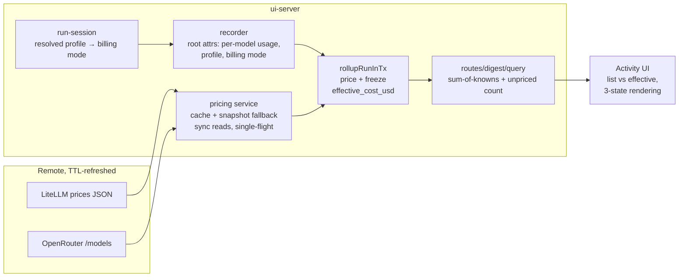

# feat: Dynamic pricing and effective cost tracking

## Summary

Build a TTL-cached, remote-refreshed model-pricing service in `ui-server` (mirroring the model-discovery source shape), classify every run's billing mode from its resolved inference profile, compute a frozen `effective_cost_usd` inside the rollup transaction, and surface dual cost (list vs effective, with explicit unknown counts) through the wire protocol, Activity UI, daily digest, and `query_activity` — while fixing the three existing sites that render unknown cost as $0. Rides along: a minimum detail-retention window so nightly cron runs stay drillable instead of losing their span trees to the morning digest's prune (U7).

---

## Problem Frame

Runs record only backend list-price accounting; subscription-billed work is indistinguishable from real pay-as-you-go spend, and unknown cost already collapses to $0 in three aggregation sites. See origin for the full frame.

---

## Requirements

- R1–R3. Pricing service: cached remote data (LiteLLM + OpenRouter), sync reads, single-flight refresh, bundled fallback, resolution rules with estimate flag (origin R1–R3)
- R4–R6. Rollup-time effective cost: frozen at first computation, root-span scope for sessions / child-sum for cron, billing classification from resolved profile with settings override, NULL=unknown 0=free semantics (origin R4–R6)
- R7–R9. Surfaces: additive wire fields, sum-of-knowns aggregation with unpriced counts, three-state UI rendering + staleness indicator (origin R7–R9)
- R10–R12. Settings override seam, migration without backfill, env descriptors, network-free tests, tool-description/contract updates (origin R10–R12)
- R13. Detail retention window: spans/events survive `activity.retention.detailDays` (default 7) in addition to the digest floor; hard ceiling unchanged (origin R13)
- R14. Tool I/O capture: input/output payloads recorded as clipped span events, rendered behind the drill-in expand affordance (origin R14)

**Origin actors:** A1 (operator), A2 (agent backends), A3 (scheduled jobs), A4 (agent as consumer), A5 (remote pricing sources)
**Origin flows:** F1 (priced run), F2 (spend glance), F3 (pricing lifecycle), F4 (billing override)
**Origin acceptance examples:** AE1 (subscription cron → free), AE2 (OpenRouter estimate), AE3 (unknown never $0), AE4 (offline snapshot), AE5 (frozen on re-rollup), AE6 (cron detail survives the window), AE7 (drill-in tool I/O expands)

---

## Scope Boundaries

- Deepgram voice / image-API spend (not in the span system)
- Exact OpenRouter per-generation accounting (v2; nitro prices flagged estimate in v1)
- Historical rollup backfill (pre-feature rows stay unknown)
- Budget alerts on effective spend
- Long-context / 1h-cache pricing tiers (base rates in v1)

### Deferred to Follow-Up Work

- brain-ui deployment shell: dependency bump + verifying the cron env allowlist in `scripts/entrypoint.sh` exposes the same credentials the server classifies against — separate PR in the brain-ui repo after release.

---

## Context & Research

### Relevant Code and Patterns

- `packages/ui-backend-claude/src/model-discovery.ts` — `createModelSource`: the exact service shape to mirror (versioned cache envelope, sync `list()`, cold-start-only await, single-flight `refresh()`, serve-stale with `state().error`, `fetchImpl`/`now` seams, `getJson` with 10s timeout + one 5xx retry)
- `packages/ui-server/src/activity/store.ts` — `rollupRunInTx` (root-span-only upsert, re-runs on every close path), `SpanUsage`, `rowToSpan` attrs parsing
- `packages/ui-server/src/activity/recorder.ts` — root attr `gen_ai.usage.per_model` (per-model tokens + SDK costUSD already persisted), `usageFromTurnUsage`
- `packages/ui-server/src/ws/run-session.ts` — recorder creation scope where the resolved profile is known (incl. the silent pin-drop fallback to the default profile)
- `packages/ui-backend-claude/src/profiles.ts` — `authTokenEnv`/`apiKeyEnv` declaration; `model-discovery.ts` `authHeaders()` — the existing OAuth-vs-API-key precedence predicate
- `packages/ui-server/src/db/settings.ts` — dotted-key JSON KV with typed accessor pairs (`getHiddenModelIds` template); `routes/models.ts` + `ui-react .../settings/models-tab.tsx` — the override REST/UI seam
- `packages/ui-server/src/config/env.ts` — self-documenting env descriptor array (new vars must be declared there)
- `packages/ui-server/migrations/009_activity_followups.sql` — house style: ADD COLUMN with explicit backfill decision, partial-index hygiene
- `packages/ui-server/package.json` `"files"` + `db/client.ts` migrations dir resolution — the same-depth relative-hop pattern for shipping the bundled snapshot (`data/` at package root)
- Aggregation sites to fix: `packages/ui-server/src/activity/digest.ts` (sum `?? 0`), `packages/ui-server/src/activity/query.ts` (same), `packages/ui-react/src/components/activity/activity-page.tsx` (`RollupCards`, run-row cost render collapsing NULL and 0)

### Institutional Learnings

- No `docs/solutions/` KB exists; binding guidance lives in `AGENTS.md` and brain-ui `docs/decisions.md` — notably **fail loud, never substitute silently**: absent pricing renders unknown, never zero (decision 3)
- Rollup aggregation is root-span-only because SDK result accounting includes subagents (double-count hazard); cron children are the sanctioned exception
- Wire additions are optional-additive; MCP tool schema changes invoke the `docs/integration-contract.md` + `CONTRACT:` ceremony
- `bun run test` only (never bare `bun test`); no test may need network or keys

### External References

- LiteLLM `model_prices_and_context_window.json`: per-single-token floats (`input_cost_per_token`, `output_cost_per_token`, `cache_read_input_token_cost`, `cache_creation_input_token_cost`, `_above_1hr`/`_above_200k_tokens` tier variants); Anthropic/OpenAI keyed bare, Gemini as `gemini/…`; ~1.4 MB; crowdsourced with known cross-key drift; `sample_spec` documents the field set
- OpenRouter `GET /api/v1/models`: public, `{"data": [...]}`, pricing as **string** per-token USD under `pricing.{prompt,completion,input_cache_read,input_cache_write,request,...}`; `:nitro`/`:floor` are request-time routing shortcuts with **no separate catalog price**

---

## Key Technical Decisions

- **Service in `ui-server`, not `ui-backend-claude`**: billing is a deployment property spanning backends and cron; discovery stayed backend-side only because it is Anthropic-credential-bound. (see origin)
- **Freeze-on-first-computation** via COALESCE-preserving upsert of the new columns: re-rollups (sweeps, cascade closes) must not silently reprice history. (origin Key Decisions / AE5)
- **Cron child-sum instead of a sink contract change**: keeps the span-sink JSONL shape stable (it ships first, per its own discipline) and is double-count-safe for cron origins.
- **Backend cost stays authoritative "list"**; the service fills `cost_usd` only when the backend reported none — two disagreeing numbers on one run would be worse than a gap.
- **Billing mode resolves at run start and rides the root span** (attr + profile id): the rollup then reads it locally, keeping `rollupRunInTx` free of registry/service lookups except the pure pricing table read.
- **Aggregates carry `unpricedRuns`**: sum-of-knowns everywhere; the UI and digest render "≥ $X · N unpriced" whenever the count is nonzero.
- **Missing cache rate → whole run unknown**: cache reads dominate Claude usage; partial pricing would systematically understate. (origin AE-relevant decision)

---

## Open Questions

### Resolved During Planning

- Historical rollups: stay NULL, no backfill (user decision)
- Sources: LiteLLM + OpenRouter merged, OpenRouter wins for `openrouter`-routed model ids (user decision)
- Freeze vs recompute; cron pricing scope; list-number authority; aggregate semantics; cache-rate gaps; estimate-flag rules — all resolved per origin Key Decisions

### Deferred to Implementation

- Exact settings-key/value shape for `models.billing` overrides (follow `models.hidden` accessor pair)
- Whether pricing freshness is exposed on `/api/models` or a sibling route — pick whichever keeps the client polling surface smallest
- LiteLLM entry validation depth: v1 validates shape + positive numbers only; cross-source sanity checks deferred
- Whether the pi backend needs a billing classification beyond "api" (it has no subscription path today)

---

## High-Level Technical Design

> *This illustrates the intended approach and is directional guidance for review, not implementation specification. The implementing agent should treat it as context, not code to reproduce.*

Billing mode decision (per run, at start): declared profile with `apiKeyEnv`/`authTokenEnv` → `api`; ambient profile → `subscription` iff OAuth present and no `ANTHROPIC_API_KEY`; settings override wins over both.

---

## Implementation Units

### U1. Protocol and pricing types (ui-sdk)

**Goal:** Additive wire/protocol types for dual cost, billing mode, estimate flag, and unpriced counts.

**Requirements:** R7 (origin R6, R7)

**Dependencies:** None

**Files:**
- Modify: `packages/ui-sdk/src/protocol.ts`
- Test: covered by `tests/api-surface.test.ts` report regeneration

**Approach:**
- Optional fields on `ActivityRunSummary`, `ActivityRunRollup`, `ActivityRunDetail.rollup`: `effectiveCostUsd?: number | null`, `billingMode?: "subscription" | "api"`, `pricingEstimate?: boolean`
- `ActivityAggregate` gains `effectiveCostUsd: number` and `unpricedRuns: number`; `ActivityDigest` mirrors both
- Document NULL-vs-0 semantics beside the existing `costUsd` comments (absent = unknown, 0 = genuinely free)

**Patterns to follow:** the rev-3 additive-usage-block comments at `protocol.ts` result-frame section

**Test scenarios:**
- Test expectation: none — pure type additions; the api-surface report diff is the verification artifact

**Verification:**
- `bun run api-report` shows only the intended new exports/fields; typecheck green across packages

---

### U2. Pricing service with bundled snapshot (ui-server)

**Goal:** The dynamic pricing source: remote-merged, cached, offline-safe, sync-read.

**Requirements:** R1, R2, R3 (origin R1–R3, plus the env-descriptor half of origin R11); F3; AE4

**Dependencies:** None

**Files:**
- Create: `packages/ui-server/src/pricing/model-pricing.ts`
- Create: `packages/ui-server/data/model-prices.json` (bundled snapshot; added to package `"files"`)
- Modify: `packages/ui-server/src/config/env.ts` (BRAIN_UI_PRICING_DISCOVERY kill switch, BRAIN_UI_PRICING_TTL_HOURS)
- Modify: `packages/ui-server/package.json`
- Test: `packages/ui-server/tests/model-pricing.test.ts`

**Approach:**
- Mirror `createModelSource`: versioned cache envelope at `$BRAIN_PATH/.brain-ui/model-pricing.json`, `resolve(modelId)` synchronous, `ensureFresh()` awaits only on cold start, single-flight refresh, serve-stale-on-error, `state()` with fetchedAt/stale/error/source (remote|snapshot)
- Fetch both sources with the `getJson` shape (10s timeout, one 5xx retry, injected `fetchImpl`); a failure of one source keeps the other's last data
- Normalize to one internal rate table: per-token input/output/cacheRead/cacheWrite; LiteLLM floats direct; OpenRouter strings parsed; OpenRouter entries keyed `vendor/model` win for ids the OpenRouter catalog carries
- Resolution: exact id → canonical alias (**port** the dated-id canonicalization — `ui-backend-claude` is only an optional peer dep of `ui-server`, so it cannot be imported) → miss. Snapshot-sourced rates mark `estimate: true`; `"0"` OpenRouter prices are genuinely free, not unknown
- Validation on ingest: shape + non-negative numbers; malformed entries dropped, not fatal

**Patterns to follow:** `packages/ui-backend-claude/src/model-discovery.ts` (whole file); `reverse-geocode.ts` for degradation discipline; migrations-dir relative-hop for reading `data/` from src and dist

**Test scenarios:**
- Happy path: fixture LiteLLM + OpenRouter payloads → `resolve("claude-sonnet-4-5")` returns per-token rates incl. cache; `resolve("z-ai/glm-4.7")` returns OpenRouter rates parsed from strings
- Happy path: dated Anthropic id resolves via alias canonicalization
- Edge: model in neither source → null; model with input/output but no cache rates → resolution result marks cache rates absent (caller decides unknown)
- Edge: OpenRouter `"0"` prices → zero rates, not null. Covers AE4: no cache file + fetch failing → snapshot serves, `state().source === "snapshot"`, resolutions flagged estimate
- Error path: corrupt cache file discarded and rewritten; one source 500s → other still merges; refresh failure preserves last good table and sets `state().error`
- Edge: kill switch off → resolve returns null for everything, state says disabled
- Integration: concurrent `ensureFresh()` bursts trigger exactly one fetch (single-flight)

**Verification:**
- All reads sync and network-free after warm-up; suite passes with no network access

---

### U3. Billing classification and the resolved-profile seam (ui-backend-claude, ui-server)

**Goal:** Every run starts with a resolved billing mode recorded on its root span.

**Requirements:** R5, R10 (origin R5, R10); F4; AE1

**Dependencies:** U1

**Files:**
- Modify: `packages/ui-server/src/agent/backend.ts` (derive and expose billing mode on registry entries — declared-profile rule from `authTokenEnv`/`apiKeyEnv`, ambient predicate for builtin/discovered; `profiles.ts` already declares the fields and needs no change)
- Modify: `packages/ui-server/src/ws/run-session.ts` (pass resolved profile + billing mode into recorder creation)
- Modify: `packages/ui-server/src/activity/recorder.ts` (root attrs: `brain.profile_id`, `brain.billing_mode`)
- Modify: `packages/ui-server/src/db/settings.ts` (`models.billing` typed accessors), `packages/ui-server/src/routes/models.ts` (override read/write)
- Test: `packages/ui-server/tests/backend-registry.test.ts` (or nearest existing registry test), `packages/ui-server/tests/activity-recorder.test.ts`

**Approach:**
- Declared profile with `apiKeyEnv`/`authTokenEnv` → `api`; builtin/discovered ambient → `subscription` iff OAuth env present and `ANTHROPIC_API_KEY` absent (reuse the `authHeaders()` precedence predicate); settings override consulted last and wins
- Cron runs: classified from the **rollup-executing process's env** — which for cron is the wrapper process under the entrypoint allowlist, exactly the credential set the job's agent authenticated with (allowlisted OAuth token, no `ANTHROPIC_API_KEY`). There is no server-env path for cron: root-span creation, sink ingest, and the finish rollup all run in the wrapper. The same ambient predicate applies; the classification lands when the root span lacks an explicit billing attr (see U4)
- The recorder receives the **resolved** profile after the pin-drop fallback in `run-session.ts` — never the requested one

**Patterns to follow:** `getHiddenModelIds`/`setHiddenModelIds` accessor pair; hidden-models PUT route validation

**Test scenarios:**
- Happy path: ambient profile + OAuth env only → root span attr `billing_mode: subscription`; declared OpenRouter profile → `api`
- Edge: ambient profile with `ANTHROPIC_API_KEY` set → `api`
- Happy path: settings override flips a declared profile to `subscription` → future runs record the override
- Error/edge: pinned profile unavailable → fallback default profile's billing mode is recorded, not the pinned one
- Integration: cron-origin run root span carries a billing mode from server env

**Verification:**
- Root spans of new runs carry profile + billing attrs in both session and cron origins

---

### U4. Migration 010 and rollup-time effective cost (ui-server)

**Goal:** `activity_run_rollups` stores frozen `effective_cost_usd`, `billing_mode`, `pricing_estimate`; computed in the rollup transaction.

**Requirements:** R4, R6, R11 (origin R4, R6, R11); F1; AE1, AE2, AE3, AE5

**Dependencies:** U1, U2, U3

**Files:**
- Create: `packages/ui-server/migrations/010_effective_cost.sql`
- Modify: `packages/ui-server/src/activity/store.ts` (`rollupRunInTx`, `rowToRunRollup`, rollup upsert conflict clause; `createActivityStore` gains an optional pricing/classification dependency)
- Modify: `packages/ui-server/src/activity/runtime.ts` (pass the server's pricing instance into its store)
- Test: `packages/ui-server/tests/activity-store.test.ts`

**Approach:**
- Migration: three nullable columns, **no backfill** (pre-feature rows are unknown by decision); comment records that choice per 009 house style
- **Seam topology (load-bearing):** cron rollups never pass through `runtime.ts` — the brain-ui cron wrapper constructs its own bare `createActivityStore(db)` and calls `store.rollupRun()` at finish. So the pricing/classification dependency attaches to `createActivityStore` itself, defaulting to a locally constructed instance (the `$BRAIN_PATH` cache and bundled snapshot are both synchronously readable at construction, mirroring the discovery source's `readCache`). The server's runtime passes its shared instance; the wrapper gets the default. Cron billing classifies inside `rollupRunInTx` from the executing process's env whenever the root span carries no billing attr — both sweep rollups and wrapper rollups then price identically via the ordinary package bump, with no brain-ui code change required
- Computation: subscription → 0 regardless of tokens; api → price per-model usage (sessions: root attr `gen_ai.usage.per_model`; cron origin: sum child spans) through `resolve()`; any consumed token class without a rate → NULL + no partial pricing
- Freeze: upsert preserves existing non-NULL `effective_cost_usd`/`billing_mode`/`pricing_estimate` (COALESCE-style conflict clause) — AE5
- Pricing service absence (disabled/cold) → NULL, never a blocking await inside the transaction; `cost_usd` gap-filling for pi/cron uses the same resolve, same freeze rule

**Execution note:** Start with failing store tests for the freeze and unknown-propagation semantics — they define the conflict clause.

**Patterns to follow:** `009_activity_followups.sql`; `rollupRunInTx` root-only comment; BEGIN IMMEDIATE discipline (already wrapping rollups)

**Test scenarios:**
- Covers AE1. Subscription-billed run with cache-heavy usage → effective 0, not NULL
- Covers AE2. API-billed run with per-model usage and full rates → priced; OpenRouter-default-rate path sets `pricing_estimate`
- Covers AE3. API-billed run, model unknown to pricing → NULL effective; rollup row otherwise complete
- Covers AE5. Re-rollup after a fixture price change → stored values unchanged
- Edge: run with usage=NULL (denied before inference) → NULL; run with 0 tokens and api billing → 0 (free)
- Edge: cron run with two child models, one unpriceable → NULL (whole-run unknown)
- Integration: migration applies cleanly on a DB created at 009 with existing rollup rows (rows stay NULL)

**Verification:**
- Fresh and upgraded DBs migrate; rollups of new runs carry the triple; frozen semantics hold across sweep-driven re-rollups

---

### U5. Aggregation, digest, and query_activity (ui-server)

**Goal:** Every aggregation surface carries effective cost + unpriced counts; the unknown-as-zero sites are fixed.

**Requirements:** R8, R12 (origin R8, R12); F2; AE3

**Dependencies:** U1, U4

**Files:**
- Modify: `packages/ui-server/src/routes/activity.ts` (rollups aggregates: SQL sums + JS fold)
- Modify: `packages/ui-server/src/activity/digest.ts` (dual sums + unpriced count; drop `?? 0` collapse)
- Modify: `packages/ui-server/src/activity/query.ts` + `packages/ui-backend-claude/src/activity-tool.ts` (dual numbers, NULL explicit in JSON, description text)
- Modify: `docs/integration-contract.md` if the tool schema is contract-bound (check; `CONTRACT:` commit if so)
- Test: `packages/ui-server/tests/routes-activity.test.ts`, `activity-digest.test.ts`, `packages/ui-backend-claude/tests/activity-tool.test.ts`

**Approach:**
- Aggregate = `SUM(effective_cost_usd) FILTER (priced)` + `COUNT(*) FILTER (effective_cost_usd IS NULL)` per day/job/session; same fold shape client-side
- List-cost aggregation keeps its current field but likewise gains an unknown count (fixing the pre-existing `?? 0`)
- Digest: `effectiveCostUsd` + `unpricedRuns` in the persisted digest object (additive; old stored digests render without them)

**Patterns to follow:** `groupedAggregates()` SQL-side sums; digest additive-field handling

**Test scenarios:**
- Covers AE3. Mix of priced/NULL runs in a window → aggregate sums only priced and reports the NULL count at every surface (rollups route, digest, query)
- Happy path: digest spanning only subscription runs → effective 0, unpriced 0
- Edge: window entirely pre-feature (all NULL) → effective sum 0 with unpricedRuns = run count — never rendered as plain $0 downstream
- Integration: query_activity JSON carries explicit nulls (not omitted) for unknown effective cost

**Verification:**
- No aggregation site sums an unknown as zero without its count riding along

---

### U6. Activity UI: dual spend, three-state rendering, staleness, settings override (ui-react)

**Goal:** The user-visible layer of F2/F4.

**Requirements:** R9, R10 (origin R9, R10); AE2, AE3, AE4

**Dependencies:** U1, U5

**Files:**
- Modify: `packages/ui-react/src/components/activity/activity-page.tsx` (RollupCards split card, run-row 3-state cost)
- Modify: `packages/ui-react/src/components/activity/digest-card.tsx`
- Modify: `packages/ui-react/src/components/settings/models-tab.tsx` (per-profile billing override control)
- Modify: `packages/ui-react/src/lib/api-client.ts` (override endpoint, pricing state if surfaced)
- Test: `packages/ui-react/tests/activity-page.test.ts` (or nearest render/helper test home), `packages/ui-react/tests/span-bits.test.ts` if the cost formatter lands there

**Approach:**
- One shared cost formatter implementing the three-state rule: NULL → "—", 0+subscription → "free", priced → "$X.XX", estimate → "~$X.XX"; used by rows, cards, digest
- **Run rows show effective cost only** (list stays on the Spend card and the detail view); the formatter's glyph replaces the existing cost span rather than appending, so the dense mono row stays width-bounded on phones
- **Spend card:** `StatCard` gains a secondary-line slot — primary bold value is effective spend, secondary muted small line carries list cost and the unpriced qualifier. User-facing copy: the card label stays "Spend (7d)"; secondary line reads "list $Y · N unpriced" (drop the "· N unpriced" clause when zero). At narrow widths (grid is 2-per-row below `sm`) the qualifier compacts to "· N?" — specified as a test scenario, not left to CSS accident
- **Staleness indicator:** a labeled, tappable affordance in the Activity header (icon + aria-label, e.g. "Pricing data is N days old"), distinguishing stale from refresh-failing in its label; tapping deep-links to Settings → Models where refresh and overrides live. Not an inert unlabeled icon — the header already carries PushToggle and refresh
- **Billing override is tri-state** (auto / force subscription / force api): a compact segmented control or select per model row — not the binary eye-toggle pattern — and the row always displays the *currently resolved* mode so an override is legible before it's touched. Optimistic update + PUT + invalidate mechanics still mirror the hidden-models flow
- **Digest card cost clause is effective-only**, with the unpriced count folded in only when nonzero ("$X spent (3 unpriced)"); list cost stays off the compact digest

**Patterns to follow:** `RollupCards`/`StatCard`; models-tab eye toggle; digest-card conditional spend line

**Test scenarios:**
- Covers AE3. Formatter: NULL → "—" (never "$0.00"); 0 → "free"; estimate → "~" prefix
- Happy path: aggregate with unpriced count renders the "≥" form
- Covers AE4. Pricing state stale+error → header indicator visible with a descriptive label and a Settings deep-link; fresh → absent
- Edge: unpriced qualifier renders the compact "· N?" form at narrow widths; run-row formatter output never exceeds the current cost-span width class
- Happy path: billing override control offers all three states, displays the resolved mode, and round-trips (optimistic + server confirm); switching back to auto removes the override rather than storing a redundant explicit value

**Verification:**
- Visual pass over Activity page + digest card with fixture data covering all three states; brain-ui local build renders (dist-bundled) after `bun run build`

---

### U7. Detail retention window (ui-server)

**Goal:** Run detail (spans/events) survives a minimum window instead of dying at the next digest — nightly cron runs stay drillable for days.

**Requirements:** R13 (origin R13); AE6

**Dependencies:** None (independent of the pricing units; touches the same `prune()` the U4 migration indexes)

**Files:**
- Modify: `packages/ui-server/src/activity/store.ts` (`prune()` candidate predicate + `PruneOptions`)
- Modify: `packages/ui-server/src/activity/runtime.ts` (read the setting, pass `detailRetentionMs`)
- Modify: `packages/ui-server/src/db/settings.ts` (typed accessor for `activity.retention.detailDays`, default 7)
- Test: `packages/ui-server/tests/activity-store.test.ts`, `packages/ui-server/tests/activity-digest.test.ts` (the floor/ceiling test extends)

**Approach:**
- Candidate predicate becomes: prunable when `(ended_at < digestFloorAt AND ended_at < now - detailRetentionMs) OR ended_at < now - hardCeilingMs` — the window ANDs with the digest floor (never prune what the digest hasn't covered; never prune younger than the window), the hard ceiling stays the independent backstop for a dead digest job
- Setting read per prune pass (hourly) so a changed value applies without restart; garbage/negative values degrade to the default per the settings-reader discipline
- The U4/U9-era partial index (`idx_activity_rollups_prunable` on `ended_at WHERE detail_pruned = 0`) already serves this shape — no new index
- Root cause worth preserving in the code comment: the digest floor was "safe to prune once summarized", but drill-in debugging is a second reader of detail with a different clock — nightly runs end before the morning digest, day sessions end after, which made pruning look cron-specific

**Patterns to follow:** `getSetting` numeric-with-fallback reads; the existing `prune()` floor/ceiling comment block

**Test scenarios:**
- Covers AE6. Run ended 5 days ago, digest-covered → detail retained; same run at day 8 → pruned
- Happy path: run digest-covered AND older than window → pruned; run older than window but NOT digest-covered → retained (floor still gates)
- Edge: window set larger than hard ceiling → ceiling still prunes (backstop wins)
- Edge: setting row corrupt/negative → default 7-day window applies
- Integration: existing floor/ceiling digest test still passes with the new predicate (window 0 reproduces old behavior)

**Verification:**
- A nightly cron run's span tree remains viewable in Activity for the configured window; hard-ceiling pruning unchanged

---

### U8. Tool I/O capture and drill-in rendering (ui-server, ui-react)

**Goal:** Expanding a tool call in the Activity drill-in shows its input and output, the way the chat timeline can — the payloads are recorded as span events instead of being dropped.

**Requirements:** R14 (origin R14); AE7

**Dependencies:** U3 (recorder.ts collision — serialize behind it). UI half collides with U6 on `activity-page.tsx` (RunDetail) — run U8 before U6 or serialize.

**Files:**
- Modify: `packages/ui-server/src/activity/recorder.ts` (capture events)
- Modify: `packages/ui-react/src/components/chat/subagent-view.tsx` (expand affordance renders payload events)
- Modify: `packages/ui-react/src/components/activity/activity-page.tsx` (RunDetail: same rendering)
- Test: `packages/ui-server/tests/activity-recorder.test.ts`, `packages/ui-react/tests/activity-store.test.ts` (or nearest view-helper home)

**Approach:**
- Capture in the recorder: on `tool_use_complete`, `appendEvent(toolUseId, "tool_input", clip(JSON.stringify(input), CAP))`; on `tool_result`, `appendEvent(toolUseId, "tool_output", clip(output, CAP))`. CAP ≈ 4 KB per event with an explicit `… [truncated]` marker (extend the existing `clip` helper). No delta accumulation — `tool_use_complete` carries the complete input object; `tool_input_delta` frames stay ignored
- Events ride the existing wire (span events already stream in snapshots/deltas, chunked at 100/frame) and die with detail pruning (U7 window bounds storage) — no schema or protocol change
- Rendering: a tool-call row in the drill-in becomes expandable when `tool_input`/`tool_output` events exist for its span; expanded content reuses the clamped mono-block styling of the chat timeline's unknown-tool fallback. Pre-feature spans (no payload events) show "no payload recorded" instead of an empty expander (AE7)
- Cron/sink-origin payload capture is wrapper-side and out of scope (origin R14)

**Patterns to follow:** `transcript_*` event flow (recorder `observeActivity` → `eventsFor` selector → subagent-view interleave); the chat timeline's clamped output block in `tool-views.tsx`

**Test scenarios:**
- Covers AE7. Recorder: `tool_use_complete` + `tool_result` produce `tool_input`/`tool_output` events with the payload; a payload over CAP is clipped with the truncation marker
- Happy path: denied tool (approval declined) records input but no output event
- Edge: `tool_result` for an unknown span id → no event, no throw (guard discipline)
- Edge: non-JSON-serializable input values (undefined members) don't break capture
- Integration: events stream to the client mirror and `eventsFor` returns them interleaved for the span

**Verification:**
- A fresh session run's drill-in expands tool calls with input/output; a pre-feature run shows the no-payload notice; server suite green

---

## System-Wide Impact

- **Interaction graph:** rollup writes now consult the pricing service (pure in-memory read inside the tx); run-session → recorder gains profile/billing pass-through; WS snapshot/delta and REST widen additively — old clients ignore the new optional fields
- **Error propagation:** pricing failures degrade to state, never into the rollup transaction or a request path; a disabled/cold service yields NULL effective cost, which every surface renders as unknown
- **State lifecycle risks:** freeze semantics guard against sweep-driven repricing; the settings override deliberately affects only future rollups (frozen history documented)
- **API surface parity:** query_activity, REST rollups, WS frames, and the digest all gain the same triple — one surface lagging would resurrect the unknown-as-zero bug there
- **Integration coverage:** migration-on-existing-DB, cron-origin classification from server env, and the digest-window-straddling-deploy case are the cross-layer scenarios unit tests alone won't prove
- **Unchanged invariants:** `cost_usd` remains backend-authoritative; the span-sink JSONL contract is untouched; rollup root-span-only aggregation stands (cron child-sum is an origin-scoped exception, not a new rule); rollups still outlive detail forever. Retention changes in exactly one way (U7): the detail-prune predicate gains a minimum-age AND-condition — the digest floor's never-prune-uncovered guarantee and the hard ceiling's independence both stand

---

## Risks & Dependencies

| Risk | Mitigation |
|------|------------|
| LiteLLM data wrong/stale for a model (known cross-key drift) | Validation on ingest; estimate flag for snapshot data; unknown-never-zero keeps errors visible; bundled snapshot regenerated each release |
| OpenRouter nitro premium not in catalog | Priced at default-provider rate, flagged estimate; exact accounting is a scoped v2 |
| Cron classification env drifts from the job's real credentials | Cron billing classifies from the wrapper process's env — the same allowlisted credential set the job's agent ran under, so classification and reality move together; the brain-ui follow-up verifies the allowlist stays in lockstep with the predicate |
| Pricing service adds a boot dependency | Mirrors model-discovery: never blocks boot or requests; snapshot fallback |
| Freeze semantics hide a genuinely wrong first price | Accepted: consistency over correction; a future admin "reprice run" action can lift the freeze deliberately |
| Wire widening breaks the pinned brain-ui client | All fields optional-additive; brain-ui bump is a follow-up release like every protocol rev |

---

## Documentation / Operational Notes

- `docs/decisions.md` (brain-ui) style entry for: aggregate unknown-count semantics and missing-cache-rate → whole-run unknown (extends the binding unknown≠0 decision) — record in brain-kit's AGENTS/docs equivalent
- Env docs regenerate from the descriptor array (`bun run env-docs`)
- `query_activity` description text updated; check `docs/integration-contract.md` binding; release is a lockstep minor (changeset) with the api-surface report regenerated

---

## Sources & References

- **Origin document:** [docs/brainstorms/2026-08-25-cost-tracking-requirements.md](../brainstorms/2026-08-25-cost-tracking-requirements.md)
- Related code: `packages/ui-backend-claude/src/model-discovery.ts`, `packages/ui-server/src/activity/store.ts`, `packages/ui-server/src/activity/recorder.ts`
- Related plan: `docs/plans/2026-08-24-001-feat-agent-observability-plan.md` (the layer this extends)
- External: LiteLLM `model_prices_and_context_window.json` (raw.githubusercontent.com/BerriAI/litellm/main/…), OpenRouter `GET /api/v1/models`
