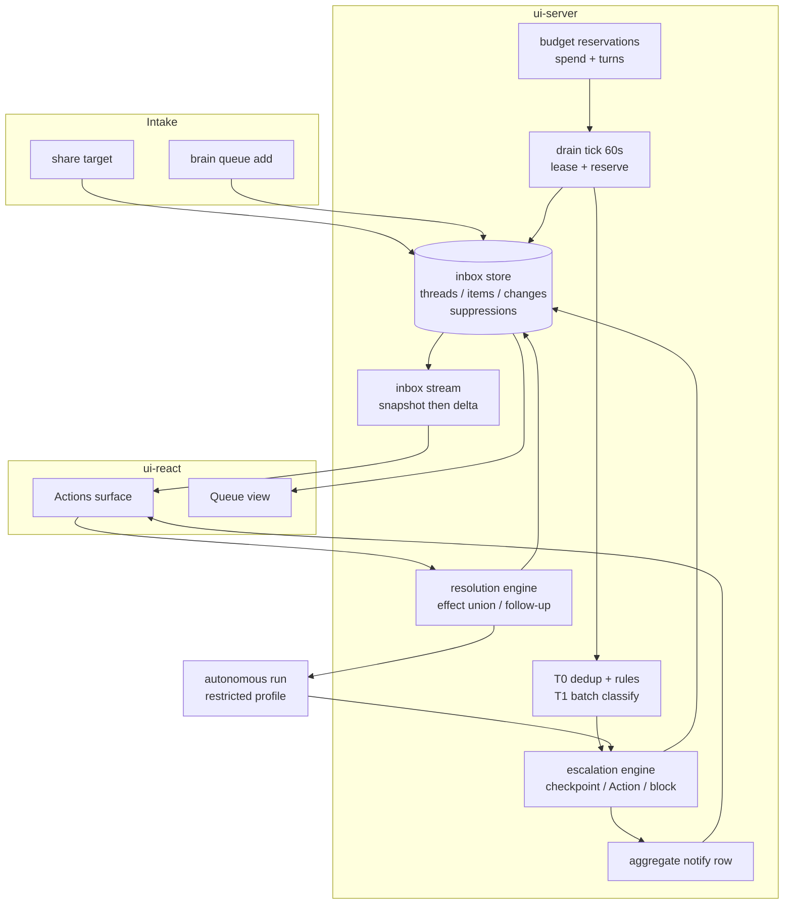

> The full autonomous v1 is bound by [the September 28 ruling](../decisions/async-collaboration.md).
> This design retains stable U1–U18 identifiers; #51 and its children own scope,
> dependencies and completion evidence. The existing Actions destination and
> activity notification inbox are integration points for the durable engine.

# feat: Async collaboration — Queue and Actions

## Summary

One durable item store with two views — a **Queue** of agent work and **Actions** of user
decisions — drained by an in-server ticking loop under leases and budget reservations, with
escalation to the user modeled as the asynchronous form of `bridge.requestPermission`.
Resolving an Action applies a validated `resolution_effect` and mints at most one follow-up
from a spec stored at escalation time, so the phone interaction costs a DB write and no
model call. Delivered as a **single v1** including headless autonomous execution and the
restricted execution profile that unattended work over untrusted content requires — the
containment build (U15) is therefore on the critical path and is sequenced early rather
than last.

---

## Problem Frame

Collaboration is synchronous-only: background work cannot ask (`requestPermission` parks a
promise nobody resolves — (`requestPermission: (req) => {`, `packages/ui-server/src/ws/bridge.ts:138-229`)), inbound material
has no path that survives until the user is present, and no decision accumulates into
standing authority. See origin for the full frame.

---

## Requirements

- R1–R11. Store: operational tables, `thread_id` on the change row, cursor algorithm reused (not the
  stream module), derived state over append-only checkpoints, Intake as thread + `triage`
  item, two guarded state machines, `resolution_effect` union, exactly-once resolution,
  suppressions table (origin R1–R11)
- R12–R17. Queue discipline: 60-item cap, FYIs uncapped and non-evictable, blocking Actions
  protected, filesystem cleanup as compensation, priority ordering with a model-suggestion
  ceiling; premise revalidation is deferred (origin R12–R17)
- R18–R27. Execution: in-server tick with `close()`, guard-aware internal poke route,
  heartbeat-based recovery, crontab line, `BEGIN IMMEDIATE` claims never wrapping model calls,
  lease sweeps, autonomous request shape, admission control with interactive priority,
  checkpoint-before-escalate, retry/dead-letter (origin R18–R27)
- R28–R32. Trust: restricted execution profile as a build item, no ambient project config,
  trust class inherited server-side, the narrowed share-decision amendment; DKIM-keyed sender
  approval is deferred (origin R28–R32)
- R33–R37. Policies: v1 does not read the path, the path is denied to every agent runtime;
  unexpected-content quarantine and revocation via `active: false` are deferred (origin R33–R37)
- R38–R46. Cost: tiering with a zero-run empty tick, token-bounded T1 batches, every
  model-bearing operation billed and counted, reservation-time enforcement, two hard caps with
  a named reserve, autonomous prompt mode for cache stability, tiering telemetry with a kill
  criterion (origin R38–R46)
- R47–R54. Surfaces: existing Actions destination, secondary Queue view, WS delta, aggregate
  notification row, `resolve_action` defined, MCP tools, restorable snapshot or renamed,
  single-user (origin R47–R54)

**Origin actors:** A1 (user), A2 (drain), A3 (autonomous agent), A4 (interactive agent),
A5 (intake sources)
**Origin flows:** F1 (arrival), F2 (drain), F3 (escalation), F4 (resolution), F5 (later),
F6 (dismiss), F7 (discuss), F8 (policy formation), F9 (closure)
**Origin acceptance examples:** AE1–AE15
**Origin trust model:** T1 (immutable server-assigned trust class), T2 (model output is data),
T3 (per-operation capabilities), T4 (server is the TCB)

---

## Scope Boundaries

### In scope: one v1, containment included

v1 ships the complete loop **and** unattended execution. R28's restricted execution profile
is a security-critical build for both first-party backends (tool availability control, scrubbed
environment, `strictMcpConfig`, real-subprocess containment testing), not a configuration
change — the current backend auto-allows `Bash`, `Write`, `Edit`, `WebFetch`, `WebSearch`,
and `Agent` (`export const DEFAULT_ALLOWED_TOOLS = [`, `packages/ui-backend-claude/src/tool-policy.ts:26-79`) and automatic SDK permission paths can bypass
`canUseTool`; the existing mandatory posture catches measured bypasses with hooks (`const enforcementHook: HookCallback`, `packages/ui-backend-claude/src/permission-hooks.ts:104-127`).

Because nothing ships until containment passes, **U14 and U15 are sequenced early** (see
Sequencing below) rather than in unit order. Discovering a containment problem after the
surface work is built would strand the whole release.

### Sequencing

Unit numbers identify design responsibilities, not progress or a strict serial order.
The dependency graph lives in #51's implementation children:

1. Protocol/store (U1/U2) establish the durable substrate. In parallel, U10's
   technical proof chooses a real policy-write boundary for both backends.
2. Headless requests (U14) depend on the substrate, not on the complete U7
   engine. Its checkpoint/escalation bridge contract is exercised with a recorder
   fixture; U7 supplies the durable transitions. This removes the old U7/U14 cycle.
3. Restricted execution (U15) depends on U14 and U10's boundary proof, and is
   built early. No production autonomous dispatcher is enabled before it passes.
4. Runtime/budgets (U3/U4), intake (U5) and the durable engine (U7) can be built
   with deterministic dispatch fixtures. Production T1/T2 (U6) also depends on
   U14/U15. Streaming (U8) depends on the substrate independently.
5. Admission (U16), fixed prompts (U17), notifications (U9), surfaces (U11/U12)
   and MCP/recovery (U13) consume those concrete prerequisites. U11/U12 share one
   store/navigation implementation; U13 tools and recovery are separate tasks.
6. The generated host's poke/snapshot scheduling is a brain-hosting-template
   child. A final system gate proves the whole loop before enabling it.

U18's existing harness, including closed #52/#53, is reused by U6 and the
system gate. It is not a prerequisite to rebuild or a new independent package.

### Out of scope entirely

- Email intake (origin R32) — v2, with DKIM-keyed sender approval.
- Policy formation (origin R34, R36, R37) — v2. **R33 and R35 are in v1**: do not read
  `context/policies/`, and close the write path regardless of who is writing.
- `discuss` sessions (origin F7, R51) — deferred; `resolve_action` is specified but unbuilt.
- Premise revalidation (origin R17) and agent-overridden snooze timing (origin R45).
- Multi-user (origin R54 is permanent).

---

## Context & Research

### Relevant Code and Patterns

- **Cursors and transactional snapshots:** (`CREATE TABLE IF NOT EXISTS activity_changes (`, `packages/ui-server/migrations/007_activity.sql:58-66`)
  and (`snapshotRun(runId) {`, `packages/ui-server/src/activity/store.ts:810-839`). Reuse the algorithm; the
  activity stream is bound to activity store methods and frame types.
- **Runtime lifecycle:** (`export function createActivityRuntime(`, `packages/ui-server/src/activity/runtime.ts:49-171`). Cron's scheduler
  owns manual triggers/history; it does not tick the inbox.
- **Two connections:** (`export function createUiDb(`, `packages/ui-server/src/db/client.ts:25-37`) sets WAL,
  foreign keys and a 5-second busy timeout. Claims are immediate transactions.
- **Auth mounting:** (`app.use("/api/*", authGuard(`, `packages/ui-server/src/app.ts:473`) follows public routes;
  (`export function authGuard(`, `packages/ui-server/src/middleware/auth.ts:189-249`) binds principals in each auth mode.
  An internal poke needs independent token authorization before this guard.
- **Permission parking:** (`requestPermission: (req) => {`, `packages/ui-server/src/ws/bridge.ts:138-229`). Timeout unwind is
  (`abortController.abort();`, `packages/ui-server/src/ws/run-session.ts:238-244`). Durable escalation must checkpoint
  before unwinding; the existing ordinary bridge does not do that.
- **Tool enforcement:** (`const enforcementHook: HookCallback`, `packages/ui-backend-claude/src/permission-hooks.ts:104-127`) closes measured bypasses.
  (`export const DEFAULT_ALLOWED_TOOLS = [`, `packages/ui-backend-claude/src/tool-policy.ts:26-79`) is still a broad interactive
  roster. A shell-command classifier is not a process write/network boundary.
- **Filtered environment and project settings:** (`export function envSnapshot(`, `packages/ui-backend-claude/src/config/env.ts:182-190`) and
  (`export function createClaudeSdkTurn(`, `packages/ui-backend-claude/src/sdk-options.ts:54-218`). Restricted execution needs
  narrower credentials/configuration; it does not start from the old full-host-env assumption.
- **Pi resources and extension gate:** (`export function createSessionResources(`, `packages/ui-backend-pi/src/session-resources.ts:31-148`) and
  (`export function createPermissionGate(`, `packages/ui-backend-pi/src/permission-gate.ts:76-146`). Built-ins are disabled,
  but ambient resources/extensions and in-process execution still need containment.
- **Cost timing:** (`store.rollupRun(runId);`, `packages/ui-server/src/activity/recorder.ts:451`) settles after execution;
  (`export function sumEffectiveCost(`, `packages/ui-server/src/activity/store.ts:177-192`) explicitly counts unpriced runs.
  Reservations must cover in-flight work, not only this retrospective sum.
- **Notifications:** (`CREATE TABLE IF NOT EXISTS notification_intents (`, `packages/ui-server/migrations/007_activity.sql:99-114`),
  (`function createIntent(input: {`, `packages/ui-server/src/activity/notify.ts:90-126`) and
  (`async deliverPending(notifier) {`, `packages/ui-server/src/activity/push-sender.ts:185-232`) are run-bound and do not
  maintain an Actions aggregate count.
- **Share provenance/limits:** (`const result = await stageShareAt(`, `packages/ui-server/src/inbox/intake.ts:86`) assigns the source in server code.
  (`export const SHARE_MAX_TEXT_BYTES =`, `packages/ui-sdk/src/protocol.ts:1248`) bounds text, not binary uploads;
  extracted T1 context needs its own byte/token bound.
- **Interactive locks:** (`const cap = host.maxConcurrentSessions();`, `packages/ui-server/src/ws/run-session.ts:642-652`) gates WS starts;
  (`export function createTurnLockBinding(`, `packages/ui-backend-claude/src/turn-lock.ts:27-119`) owns tool locks.
  Shared-target priority and cooperative yield belong to the keyed lock and backend lifecycle.

### Institutional Learnings

- **Fail loud, secure by default** (an earlier fail-loud decision): the dominant defect
  shape found in review was silent substitution instead of loud failure. R36's
  quarantine-not-notify and R41's reservation-not-retrospective-sum both exist because
  revision 1 of the origin reproduced that shape.
- **Predicate-only tests do not establish containment** (AGENTS.md, "Testing expectations"): the
  renderer's real isolation holes were found by launching Chrome, not by unit-testing an
  allowlist. U15 inherits this rule verbatim.
- **A confirmed share is never acted on automatically** (#6): origin R31 amends this narrowly
  and only for triage inside an envelope that U15 must actually build before it is exercised.

### External References

- Claude Agent SDK `persistSession`, tool availability (`tools` vs `allowedTools`),
  `strictMcpConfig`, and `excludeDynamicSections` — all present in the installed
  `@anthropic-ai/claude-agent-sdk` type surface; verify against the pinned version at
  implementation time rather than trusting this line.

---

## Key Technical Decisions

- **Two state machines, not one chain.** Queue items are claimed; decisions are not. A single
  chain produced states that were terminal for one participant and resumable for the other.
- **`resolution_effect` is a closed, schema-validated union.** Snooze, dismissal, denial,
  policy acceptance and discuss are not enqueues; a follow-up-spec-per-option could not
  express them. Deferred union variants are schema-defined but unavailable in v1.
- **Trust class is server-assigned and immutable per thread**, absent from every
  model-authored schema. Without it a compromised triage output routes its own follow-up as
  trusted work.
- **Checkpoint before the gate, not after.** A model blocked on a parked permission promise
  cannot write anything, so escalation is a server-side step: checkpoint → create Action and
  block → unwind through the tested denial/abort path.
- **Budgets reserve at claim time.** Cost exists only after `finish()`, and unpriced runs are
  separately counted but excluded from numeric sums; ignoring that count fails open.
- **The empty tick is free.** No model call and no Activity run — at 60s cadence, recording
  empty ticks would add ~1,440 runs a day and distort every rollup.
- **Two escalation-policy calls, decided 2026-08-27, both of which reduce queue pressure.**
  An *expiring option carrying no obligation* is an Action only when the consequence is
  significant — a low-stakes window closing gets filed, not escalated. And a *destructive action
  the user has explicitly delegated* is performed in a **reversible** form (archive rather than
  delete) with a notification afterwards, rather than escalated. The second deliberately narrows
  "anything irreversible escalates": where the user has already delegated, the agent's job is to
  make the action reversible, not to hand it back. Both rules belong in the triage prompt, and
  both are encoded in the eval's labels.
- **Tiering ships with a kill criterion.** T1 is justified only if it measurably diverts work
  or shrinks T2 context; U6 carries the telemetry that decides it.
- **Containment gates the release, so it is built first.** The single-v1 shape puts U15 on the
  critical path; sequencing it early is what keeps that from becoming a late surprise.
- **Interactive priority yields only at denial risk.** A reserved-capacity-only scheme can
  still bounce an interactive turn at the 30s lock timeout; an always-yield scheme burns
  tokens on every preemption. The trigger is an explicit wait threshold, not a judgement call.
- **Unpriced runs reserve pessimistically and surface an Action.** Silent approximation hides
  an accounting hole; blocking turns a pricing-source lag into unexplained stalled work.
- **Dismissal reasons distinguish bad authority from bad judgement.** That distinction is the
  mechanism by which escalation volume falls; a binary vocabulary cannot express it.

---

## Open Questions

### Resolved During Planning

- Intake representation → thread + `triage` item, no separate table (origin R6).
- Blocked item disposition after resolution → `superseded` (origin R7); exactly one executable
  item survives.
- Suppression storage → its own table; a resolved item row cannot serve the role because
  suppression outlives the item and is keyed by class.
- Follow-up dedup → derived from `(action_id, option_id)` in the resolution transaction.
- Whether FYIs count against the cap → no, and they are non-evictable (origin R13).

- **Scope shape** → a single v1 including containment. U15 is on the critical path and is
  sequenced early; nothing ships until its adversarial pass is green.
- **Interactive priority** (origin R25) → **hybrid, yield at denial risk**. Reserved capacity
  normally; an autonomous run yields only when an interactive turn's lock wait crosses an
  explicit threshold (~20s of the 30s budget). Requires waiter-priority tracking and a yield
  channel into a running autonomous turn — new plumbing, specified in U16.
- **Unknown cost under reservation** (origin R41) → **pessimistic reserve plus an Action**,
  with the Action suppressed per *model* rather than per run so one unpriced model does not
  file an Action on every claim.
- **Dismissal vocabulary** → **four-way**: don't ask again / wrong call / need more info / no
  longer relevant. Each maps to a distinct agent behavior. A reason never itself grants
  authority — "don't ask again" can only cause a policy *proposal* the user separately
  approves, or a single dismissal tap becomes a privilege grant.

### Historical measurements and subsequent source audit

- **Priority score** (U2) — computed at read time, never stored:
  `4×stakes + 3×deadline_urgency + min(age_days, 5) − min(attempts, 3)`.
  `stakes ∈ {1,2,3}` with model suggestions clamped to 3; `deadline_urgency ∈ {0..3}`
  (`<24h`=3, `<72h`=2, `<7d`=1, else 0); age **raises** score so nothing starves, capped at 5;
  attempts demote thrashers, capped at 3. Eviction takes the lowest score, ties broken by
  oldest `created_at`. Storing the score would freeze `age_days` and defeat the anti-starvation
  term — this is the detail that makes or breaks it.
- **State projection** (U2) — 4 KB cap (~1k tokens), matching the existing span-event clip cap.
  Compaction is **lazy**: performed at the start of the next run that would exceed it, folded
  into that run's existing model call, never a dedicated compaction run. Preserves decisions
  made, capabilities granted, paths touched, and open questions; drops narration. Trust class
  and provenance are columns, so compaction cannot drop them (R4).
- **Internal route** (U3) — mounted **before** the guard on the main listener, which is the
  established pattern (`app.ts` registers health, auth, passkey-public, and the share-target
  fallback before `app.use("/api/*", authGuard(...))`). Authorization is a **boot-minted
  ephemeral token** in a `0600` file under `/run`, read by cron per invocation, with the
  loopback check as a secondary. Not loopback alone: behind a reverse proxy the remote address
  is the docker bridge, and under `--network host` a proxied request can present as `127.0.0.1`
  — so address is corroboration, not authorization. The token never leaves the container and
  rotates every boot, so there is nothing to store or rotate manually.
- **T1 model and batch budget** (U6) — **`claude-sonnet-5`**, `output_config: {effort: "low"}`,
  `max_tokens ≈ 256` per item, batch bounded at **40k input tokens** with per-item truncation at
  **4k tokens**. `budget_tokens` is rejected on Sonnet 5 — depth is `output_config.effort`.

  Chosen on evidence, not price. A 24-item labeled triage eval (6 slices, batches of 8, 5
  repeats, raw JSON with no constrained decoding) across three providers, all driven by raw API
  calls through one scorer — no agent harness on any side, since a harness would measure the
  harness rather than the model and would not be comparable across vendors:

  | model | route acc | user-missed | schema-fail | $/1k items | ms/call |
  |---|---|---|---|---|---|
  | Haiku 4.5 | 88.6% | **3** | 0 | $0.52 | 3924 |
  | Sonnet 4.6 | 96.2% | 0 | 0 | $1.36 | 7516 |
  | **Sonnet 5** | 98.1% | 0 | 3 | $1.99 | 6953 |
  | Opus 5 | **100%** | 0 | 0 | $2.84 | 5488 |
  | gpt-5.6-luna | 88.6% | **4** | **8** | $0.09 | 3722 |
  | gpt-5.6-terra | 97.1% | 0 | 0 | $0.85 | 2938 |
  | gpt-5.6-sol | **100%** | 0 | 0 | $1.62 | 5421 |
  | gemini-3.7-flash | 93.3% | **2** | 0 | $0.38 | 1899 |

  Injection obedience was **0/240** across all eight (separate focused run: 3 attack patterns ×
  10 reps × 8 models, attacks embedded in mixed batches).

  Findings that decided it:
  - **`user-missed` is the disqualifier, not accuracy or price.** An item needing human
    authority that gets silently filed is the precise failure this feature exists to prevent.
    Four models score zero on it: Sonnet 4.6, Sonnet 5, gpt-5.6-terra, gpt-5.6-sol. Everything
    else is out regardless of how cheap it is.
  - **Haiku 4.5 missed three**, including a German tax-declaration notice with an October
    deadline routed `rule`. Its weakness is concentrated in the `rule` slice (60% vs 90% Sonnet
    5) while scoring 100% on `agent` and `user` — file-vs-escalate judgement, which is exactly
    T1's job.
  - **gpt-5.6-luna is the cheapest by an order of magnitude ($0.09/1k) and unusable**: 4 missed
    escalations and 8 schema failures, meaning it silently dropped items from batches. This is
    an empirical confirmation of the standing never-use-luna rule rather than an exception to it.
  - **On raw quality the best two are gpt-5.6-sol and Opus 5, tied at 100%** — and sol is 43%
    cheaper. **gpt-5.6-terra is the best accuracy-per-dollar** (97.1%, zero missed, $0.85, and
    the fastest of the accurate models at 2.9s).
  - **Historical August 26 proposal: Sonnet 5 on architecture rather than the table.** Autonomous runs bill
    through the Claude subscription (`CLAUDE_CODE_OAUTH_TOKEN`), so a Claude T1 costs **$0
    against the $5/day non-subscription cap**, while a GPT or Gemini T1 spends real,
    cap-consuming dollars. It also needs no second API key in the cron allowlist, no second
    rate-limit domain, and no new backend: the proposal assumed a generic OpenAI-compatible backend was required. The
    September 30 audit instead finds a direct OpenAI completion transport in the
    triage harness; production integration/accounting still belongs to U6. Sonnet 5's 98.1%
    versus sol's 100% is about two items in 105.
  - **Historical proposal to revisit after a generic OpenAI-compatible backend.** terra at $0.85/1k with zero
    missed escalations, and sol matching Opus 5 at 57% of its price, are both genuinely better
    on the numbers — they are gated on architecture, not on quality.
  - gemini-3.7-flash is the fastest tested (1.9s) and cheap, but two missed escalations rule it
    out now; it is the one to re-test if T1 latency ever matters.

  **Effort sweep — the cheap/fast tier, and the finding that outranks the model choice.**
  Effort ladders were probed against each live endpoint, not assumed: OpenAI `gpt-5.6-*` takes
  `none|low|medium|high|xhigh` (`minimal`/`max` rejected); Gemini 3.7-flash takes
  `low|medium|high` via `thinkingConfig.thinkingLevel`; GLM 5.3-flash takes
  `minimal|low|medium|high|xhigh` and cannot disable reasoning at all.

  Raising effort helps the cheap models substantially — gpt-5.6-luna went 86.9% → 95.2% → 99.4%
  across low/medium/high in one 8-rep run, with its `rule` slice climbing from 68.8% to ~100%.
  But the headline result is what did **not** stabilize:

  | run | luna effort | route acc | usr-miss | schema (dropped rows) |
  |---|---|---|---|---|
  | 3 reps | medium | 100% | 0 | 0 |
  | 8 reps | medium | 95.2% | 4 | 8 |
  | 8 reps | high | 99.4% | 0 | 0 |
  | 10 reps | high | 95.2% | 0 | **8** |
  | 10 reps | xhigh | 98.6% | 0 | 0 |

  **The cheap models intermittently omit rows from a batch response** — eight missing rows is one
  whole batch of eight items that were never classified. The rate falls as effort rises but never
  demonstrably reaches zero, and it moves between runs at the same setting. gpt-5.6-sol at `low`
  returned 100% / 0 / 0 in every single run; Sonnet 5 dropped rows once across its runs too, so
  this is not a cheap-model-only hazard, merely a cheap-model-mostly one.

  The engineering conclusion matters more than the ranking: **U6 must verify batch completeness
  and re-submit missing ids individually**, for every model. With that guard, luna at `xhigh`
  ($0.15/1k, 98.6%) or terra at `high` ($0.88/1k, 96.7%, zero missed) become genuinely viable
  against sol at $1.64 — the drop becomes a latency blip instead of an untriaged arrival. Without
  it, only the models that never drop rows are safe, which is an expensive way to buy something a
  completeness check gives for free. This did not change the August 26 proposal — Sonnet 5's
  subscription-billing and no-new-backend arguments are untouched — but it does change what U6
  has to build.

  **glm-5.3-flash was investigated in depth, and the investigation invalidated the ranking
  above.** It first measured at 86.7–92.4% with 3–5 missed escalations per run, and was written
  off as systematically under-escalating. That conclusion was wrong, and the way it was wrong is
  the most important methodological result in this whole exercise.

  Its errors turned out to be confined to three items — and those are precisely the items other
  models also disputed. Split the dataset by whether the gold label is contested:

  | slice | result |
  |---|---|
  | uncontested items (144 judgements) | **100.0%**, zero missed escalations |
  | contested items (24 judgements) | 37.5% |

  Every single GLM error was on a label that was already in doubt. Four candidate mechanisms
  were tested and all four refuted, which is what forced the re-examination:
  - **Provider lottery** — OpenRouter spreads this model across nine backends of differing
    quantization. Accuracy did not separate by provider (Z.AI 94% over 151 observations, others
    comparable on smaller samples).
  - **Reasoning starvation from batching** — refuted directly: reasoning tokens *per item* rise
    with batch size (5 → 13 → 17 → 21 for batches of 1/2/4/8), they do not fall.
  - **Anti-repetition pressure** — refuted: given eight unambiguous same-route items it emitted
    the identical route 63/64 times, in both directions.
  - **Route/summary contradiction** — the original "comprehension right, route wrong" reading.
    On closer inspection the summaries were not contradicting the route; they were articulating
    a *different, defensible* judgement about a genuinely ambiguous item ("reversible file
    action", "routine hygiene" on an archive request the human had phrased as a question).

  Two correction attempts were also tried and both failed, recorded so they are not re-attempted:
  - **A tie-break rule in the prompt** ("route needs_agent whenever useful work precedes the
    decision") made every model worse — missed escalations went 0→8 for sol, 0→5 for luna and
    terra, 3→11 for GLM. Nearly every decision has some prep work, so the rule cannibalizes
    escalation. Prompt changes that improve consistency can wreck the metric that matters.
  - **A separate `requires_human` flag, enforced deterministically** (`requires_human ⇒
    needs_user`). The flag is only ~90% self-accurate: it recovered one miss on GLM, none at
    `high`, and cost luna six false escalations, dropping it from 93.3% to 87.6%. A second
    model-authored signal is not a free correctness check.

  GLM is genuinely slower than the alternatives (6.8–18.3s per batch versus luna's 4–7.6s), and
  that remains a real difference. Its accuracy deficit does not.

  **Superseded by the real benchmark run.** The exploratory numbers above are kept only as the
  record of how the methodology was arrived at. The eval now lives at
  `packages/ui-server/evals/triage/` (U18) with validated labels, a gate, and persisted results
  in `benchmarks.json` — 31 configurations across 9 models and their full effort ladders, 20
  items x 4 reps. Passing configurations, cheapest first:

  | configuration | recall | filing | $/1k | ms/call |
  |---|---|---|---|---|
  | gpt-5.6-luna @ medium | 100% | 100% | $0.147 | 4347 |
  | gpt-5.6-luna @ high | 100% | 100% | $0.176 | 5217 |
  | gpt-5.6-terra @ low | 100% | 100% | $1.154 | 3436 |
  | gpt-5.6-terra @ high | 100% | 100% | $1.402 | 4803 |
  | **sonnet-4.6 @ low** | **100%** | **100%** | **$1.660** | **5489** |
  | opus-5 @ low | 100% | 100% | $3.551 | 5520 |

  The decisive finding: **`claude-sonnet-5` fails at every effort level** (4–6 missed
  escalations, both runs), as do `gemini-3.7-flash` (8 missed, every effort) and
  `glm-5.3-flash` (1–2 missed, plus rows lost). `gpt-5.6-sol` misses one at every effort.
  Held across both runs: terra and sonnet-4.6 pass everywhere, opus-5@low passes.

  **Verdicts at the margin are not stable at 4 reps**, and the benchmark file says so: across
  the two runs `haiku-4.5` and `gpt-5.6-luna@xhigh` each passed once and failed once, and
  `gpt-5.6-luna@medium` did the reverse. Raise `--reps` before treating a marginal PASS as a
  decision. This is why the gate reports the worst single pass alongside the mean.

  **Consequence for the exploratory numbers above: they could not rank models.** Its
  discriminating power came almost entirely from three contested labels, so the 1–3 item gaps
  separating luna, terra, sol and the Anthropic tiers are not trustworthy either — only GLM was
  measured against the contested/uncontested split. Before any model decision is taken on
  evidence, the dataset needs unambiguous-but-hard items, and the split needs running for every
  candidate. The August 26 Sonnet 5 proposal rested on its architectural argument
  (subscription-billed, no new backend, no second key) and **not** on a measured quality
  advantage, which the eval has not established.

  **Caveats, so this is not over-read:** 24 authored items is small — the `rule` slice is 4
  items, so single-item swings move it ~5 points, and run-to-run variance at 3 reps was several
  points (Sonnet 5 showed 0 schema failures in two runs and 3 in another). The dataset is
  synthetic, not sampled from real arrivals. **Absolute accuracies are not comparable across
  dataset revisions** — two items were relabelled mid-investigation, which moved every model's
  score by several points; only figures from the same revision may be compared. The deeper
  lesson: three items admitted a legitimate "agent preps, then the human decides" reading, and
  the models were not wrong so much as **guessing at a convention the task never stated**. When
  every model agrees against a label, suspect the label. R46's telemetry should re-run this against **real**
  arrivals once they accumulate.

  **The injection number is the most over-readable figure here and deserves its own warning.**
  0/240 is a classification result from a harness with **no tools and no filesystem** — a model
  that cannot read a file cannot leak a key no matter what the text asks. It says these models
  do not let embedded text steer their routing. It says *nothing* about what a model with real
  tool access would do, which is a containment question owned by U15's live-subprocess suite.
  Two successive detector bugs in this eval also scored correct refusals as obedience (a
  substring test for `trusted` matched "un**trusted**"; a keyword leak test matched summaries
  describing the attack) — so any future version of this check must score **behaviour**, never
  keywords that appear in the right answer.
- **September 30 source audit (U14/U15).** Autonomous mode remains generic and
  both first-party runtimes owe containment proof. Pi's resource loader can load
  extensions and ambient instructions, and its permission gate is an inline
  `tool_call` extension, not a wrapper inside each curated executor. Filtering
  `ToolDefinition[]` alone does not close all writers/egress. Installed pi
  `SessionManager.inMemory` and Claude `persistSession: false` expose nonpersistent
  modes; test actual history/side effects before declaring conformance. The current
  `AgentBackend` terminal protocol still requires `session_info` for ordinary turns;
  an additive explicit autonomous mode must preserve that existing contract.
- **T1 transport is distinct from an agent backend.** The harness already calls
  OpenAI chat completions directly. Core's built-in completion providers are
  Anthropic/Gemini; `CompletionProvider.complete` returns text, not usage/cost.
  U6 needs an accounted production path using the existing provider configuration
  and pricing conventions, not a new AgentBackend solely for classification.
  The model/effort ranking recorded in U6 is historical; verify availability,
  supported effort and prices at implementation/enablement time.

---

## High-Level Technical Design

> *Directional guidance for review, not implementation specification.*

Trust flows one way: the source assigns `trust_class` at F1, every item and follow-up
inherits it, and no model output can name it. Capability grants are minted per resolved
operation, never attached to a role.

---

## Implementation Units

### U1. Protocol and inbox types (ui-sdk)

**Goal:** The wire contract for threads, items, changes, effects, and capability advertisement.

**Requirements:** R1, R8, R49 (origin R1, R8, R49)

**Dependencies:** None

**Files:**
- Modify: `packages/ui-sdk/src/protocol.ts`
- Modify: `packages/ui-sdk/src/schemas.ts` (inbound frames go through `parseClientMessage`)
- Test: covered by `tests/api-surface.test.ts` regeneration

**Approach:**
- `InboxThread`, `InboxItem`, `InboxChange`, `InboxSnapshot`, `InboxDelta` types; `queue`,
  `type`, `status` as string unions matching the two state machines
- `ResolutionEffect` as a discriminated union on `kind`: `enqueue` | `cancel_blocked` |
  `snooze` | `dismiss` | `write_policy` | `open_session`, each with its own payload shape
- Client→server frames: `inbox_resolve` (item id, option id, optional reason), `inbox_snooze`,
  `inbox_subscribe` — added to the zod discriminated union, never cast
- `capabilities.inbox` on `server_hello`
- **No trust, profile, or tool-policy field appears in any model-authored payload type** (T2);
  encode that as a comment on the effect union so it survives future edits

**Patterns to follow:** the additive-optional discipline of the activity protocol widening;
`schemas.ts` discriminated-union parsing

**Test scenarios:**
- The api-surface report diff checks additive types; runtime schema tests check
  accepted/rejected frames and capability negotiation
- Schema: an `inbox_resolve` frame carrying an unexpected `trustClass` field is rejected, not
  silently ignored

**Verification:** `bun run api-report` shows only intended additions; typecheck green

---

### U2. Inbox store and migration (ui-server)

**Goal:** The durable substrate — explicit operational state, guarded transitions, atomic item+change writes.

**Requirements:** R1–R11, R15 (origin R1–R11, R15); F1, F4

**Dependencies:** U1

**Files:**
- Create: `packages/ui-server/migrations/<next>_inbox.sql`
- Create: `packages/ui-server/src/inbox/store.ts`
- Create: `packages/ui-server/src/inbox/state.ts` (transition tables)
- Test: `packages/ui-server/tests/inbox-store.test.ts`

**Approach:**
- Tables: `inbox_threads` (trust_class, state projection, priority components, source, status),
  `inbox_items` (queue, type, status, payload, options with effects, wait_until, expires_at,
  claimed_at, lease_until, attempts, dedup_key, blocked_by_item_id, run_id, version),
  `inbox_changes(change_id AUTOINCREMENT, thread_id, item_id, seq)`, `inbox_suppressions`
  (class key, evidence boundary, expiry, re-raise condition)
- Explicit durable resolution records, scheduler heartbeats and budget reservations
  are required; specify their schema, uniqueness and ownership, not just columns
  implied by a later unit. Current migrations already occupy 011/012 through 019;
  select the next unused ordinal at implementation time. Never amend a shipped migration.
- `inbox_checkpoints` as append-only run history per thread; the thread's `state_md` column is
  a **projection** written from it, never edited directly (R4)
- Two transition tables in `state.ts`; every mutation goes through one guarded function that
  rejects an undeclared transition rather than writing it
- Every item write and its change row land in one transaction, mirroring the activity store's
  discipline — `change_id` global cursor, `seq` per thread
- Snapshot read is a single transaction returning per-thread high-water marks
- Unique constraints: `dedup_key`, and one resolution per Action (R9)
- **Priority is computed at read time**, never stored:
  `4×stakes + 3×deadline_urgency + min(age_days, 5) − min(attempts, 3)`. Stored columns are the
  *components* (stakes, deadline, created_at, attempts). A stored score would freeze
  `age_days`, and the age term is the whole anti-starvation mechanism
- **State projection**: 4 KB cap (matching the span-event clip cap). On overflow, the next run
  that needs the projection compacts it as part of its own model call — no dedicated compaction
  run. Compaction preserves decisions, granted capabilities, touched paths, and open questions;
  it drops narration. It cannot drop trust class or provenance, which are columns (R4)

**Patterns to follow:** `packages/ui-server/src/activity/store.ts` (transaction shape,
write-once outcome discipline, cursor emission); migration comment style of `007`/`009`

**Test scenarios:**
- Happy path: item write emits exactly one change row with the correct `thread_id`/`seq`
- Edge: an undeclared transition (`snoozed → claimed`) throws rather than writing
- Edge: `claimed → ready` on lease expiry, `blocked → superseded` on resolution,
  `failed → ready` on backoff — each explicitly covered (AE-adjacent to origin R7)
- Edge: duplicate `dedup_key` insert is a no-op update of `last_seen_at`, not a second row
- Edge: two concurrent resolutions of one Action — exactly one wins (AE4)
- Edge: an Action's priority **rises** with age, so a low-stakes item cannot starve behind a
  stream of higher-stakes arrivals; asserted by advancing an injected clock, which only works
  because the score is not stored
- Edge: a model-suggested stakes value of 4 is clamped to 3
- Edge: a projection at the 4 KB boundary compacts on next use and retains the recorded
  decisions; trust class survives compaction unchanged
- Integration: snapshot at cursor N plus deltas after N reconstructs the same state as a
  fresh snapshot

**Verification:** store suite green; migration applies to an existing populated DB

---

### U3. Drain loop, leases, and the backstop poke (ui-server + the deployment)

**Goal:** Work moves without a human, and the loop's own death is detectable.

**Requirements:** R18–R23 (origin R18–R23); F2; AE2, AE13

**Dependencies:** U2

**Files:**
- Create: `packages/ui-server/src/inbox/runtime.ts`
- Create: `packages/ui-server/src/routes/internal.ts`
- Modify: `packages/ui-server/src/app.ts` (mount internal route **before** the guard)
- Deployment: the hosting template's entrypoint gains the five-minute poke line (brain-hosting-template, not this repo)
- Test: `packages/ui-server/tests/inbox-runtime.test.ts`

**Approach:**
- 60s interval with a `close()` lifecycle, modeled on (`export function createActivityRuntime(`, `packages/ui-server/src/activity/runtime.ts:49-171`), including
  its boot sweep
- **Gate first**: a SQL count of ready items; zero means return immediately — no model call and
  **no Activity run** (AE2)
- Claim under `BEGIN IMMEDIATE` writing `claimed_at` + `lease_until`; the immediate transaction
  covers the claim only — never a model call, never filesystem work (R22)
- Persist a scheduler heartbeat row; the poke compares its age against a staleness threshold,
  re-arms the interval or runs one drain, and takes an advisory flag so a poke and a tick
  cannot overlap
- Internal route mounted **before** the auth guard on the main listener — the established
  pattern (`app.ts` registers health, auth, passkey-public, and the share-target fallback ahead
  of `app.use("/api/*", authGuard(...))`), so no second listener is needed
- Authorization is a **boot-minted ephemeral token**: the server writes a random value to a
  `0600` file under `/run` at startup; the crontab poke reads it per invocation. The loopback
  address check is corroboration, not authorization — behind a reverse proxy the remote address
  is the docker bridge, and under `--network host` a proxied request can present as
  `127.0.0.1`, so address alone is not a boundary. The token never leaves the container and
  rotates on every boot, so there is nothing to store, ship, or rotate by hand
- Boot sweep and periodic sweep return expired leases to `ready`

**Patterns to follow:** activity runtime tick/sweep/close; poke authorization
fails closed while an unavailable poke never corrupts committed queue state

**Test scenarios:**
- Happy path: a ready item is claimed exactly once with a lease in the future
- Covers AE2: empty ready set → zero model calls, zero Activity runs recorded
- Covers AE13: a stopped interval with a stale heartbeat is re-armed by the poke; expired
  leases return to `ready`
- Edge: **the poke reaches the route in password mode**, not only tailscale/none — the
  regression this unit exists to prevent
- Edge: a request to the internal route with **no token or a stale token is refused** in every
  `AUTH_MODE`, including from a loopback address
- Edge: the route is unreachable from a non-loopback address in every `AUTH_MODE` — asserted,
  because mounting ahead of the guard is exactly the mistake that would widen an external
  surface
- Edge: a server restart rotates the token and the next poke reads the new one
- Edge: a poke arriving during an in-progress tick does not double-drain
- Edge: two processes racing a claim — one wins, the other sees no rows (run against a real
  second connection, not a mock)
- Edge: a cron heartbeat write racing an inbox claim does not exceed the 5s busy timeout

**Verification:** runtime suite green; a manual container run shows the crontab poke line and a
recovered tick after killing the interval

---

### U4. Budget reservations (ui-server)

**Goal:** Caps that hold at admission, not in hindsight.

**Requirements:** R40–R43 (origin R40–R43); AE11

**Dependencies:** U3, U14

**Files:**
- Create: `packages/ui-server/src/inbox/budget.ts`
- Create: a new, next-unused migration for reservation state; never rewrite U2's shipped migration
- Modify: `packages/ui-server/src/activity/store.ts` (settlement in the terminal rollup transaction)
- Test: `packages/ui-server/tests/inbox-budget.test.ts`

**Approach:**
- A reservation is written in the claim transaction with a conservative estimate; settlement at
  `rollupRun` freezes actual spend and releases only the unused difference
- Two counters: non-subscription effective spend (default $5/day) and autonomous turns/day,
  both against the configured local-day boundary
- Query filters autonomous origins and preserves `unpricedRuns` rather than dropping them —
  ignoring the explicit unpriced count at (`export function sumEffectiveCost(`, `packages/ui-server/src/activity/store.ts:177-192`) is the admission bug being avoided
- **Unknown cost settles at a pessimistic rate, and files an Action.** A run whose effective
  cost resolves NULL is charged a configured worst-case rate against the counter, so the
  budget errs toward stopping early rather than overspending. It simultaneously raises an
  Action ("model X has no resolvable price — pin a rate or switch models"), **suppressed per
  model** so an unpriced model files one Action, not one per claim. Subscription-billed runs
  are $0 regardless and never reach this path — only API-billed unpriced runs do
- Degenerate case: no resolvable price *and* no token counts → the claim is refused, since
  there is nothing to estimate from
- Hard caps with a named emergency reserve; when the reserve is exhausted, everything stops and
  one `fyi` is filed (R43)
- Every model-bearing operation reserves, including T1 batches (R40)
- The [October 1 ruling](../decisions/async-collaboration.md#scheduling-budgets-and-evidence)
  defines a hard admission ledger, using conservative whole-operation estimates.
  Retain actual overruns and refuse later over-cap work; U4 does not add a
  transport-enforced invoice ceiling. Count one turn per separately dispatched
  model-bearing operation; folded compaction is included in its existing call.

**Patterns to follow:** the frozen-at-first-computation discipline of effective cost
(`function rollupRunInTx(runId: string) {`, `packages/ui-server/src/activity/store.ts:502-604`); env descriptor array for the new configuration values

**Test scenarios:**
- Covers AE11: two claims that would each fit but jointly exceed the cap — the second is
  refused at claim time, not discovered at finish
- Edge: a run finishing with unknown cost is charged the pessimistic rate — never zero — and
  files exactly one Action for that model no matter how many unpriced runs follow
- Edge: an unpriced **subscription-billed** run moves the turn counter only and files no Action
- Edge: unknown price with no token counts refuses the claim rather than guessing
- Edge: subscription-billed runs move the turn counter and not the dollar counter
- Edge: a crashed run's observed spend is retained; the lease sweep releases only
  unused reservation, never erasing already-incurred cost
- Edge: day boundary crossing mid-run settles against the day the run started

**Verification:** budget suite green; a forced over-cap scenario stops work with one `fyi`

---

### U5. Intake — share target and CLI (ui-server)

**Goal:** Arrivals become threads with a server-assigned trust class.

**Requirements:** R3, R6, R10, R30 (origin R3, R6, R10, R30); F1; AE1

**Dependencies:** U2

**Files:**
- Modify: `packages/ui-server/src/routes/share.ts` (route the staged share into a thread)
- Create: `packages/ui-server/src/inbox/intake.ts`
- Modify: `packages/ui-server/src/brain/client.ts` (or the CLI seam) for `brain queue add`
- Test: `packages/ui-server/tests/inbox-intake.test.ts`

**Approach:**
- One arrival → one thread (trust class from the source record, hardcoded server-side per the
  (`const result = await stageShareAt(`, `packages/ui-server/src/inbox/intake.ts:86`) precedent) + one `triage` Queue item; bytes stay in the staging
  directory
- `dedup_key` from a content hash for shares; from an explicit key for authenticated CLI adds
- Trust class is written by the server and is not a parameter of any request body

**Patterns to follow:** `share/staging.ts` manifest handling and its source hardcoding

**Test scenarios:**
- Covers AE1: same link shared twice within a minute → one thread, one item, one staging dir;
  second arrival updates `last_seen_at`
- Edge: a request body attempting to set `trustClass`, `source` or profile is
  rejected; authenticated source provenance is assigned by the server
- Edge: staging write succeeds but the DB write fails → no orphan thread; the staging dir is
  reconciled by the cleanup compensation (U7)

**Verification:** intake suite green; a real share from the PWA lands a `triage` item

---

### U6. T0/T1 triage with telemetry (ui-server)

**Goal:** Cheap routing, bounded batches, and the evidence that decides whether T1 survives.

**Requirements:** R38, R39, R46 (origin R38, R39, R46); F2; AE15

**Dependencies:** U3, U4, U14, U15

**Files:**
- Create: `packages/ui-server/src/inbox/triage.ts`
- Test: `packages/ui-server/tests/inbox-triage.test.ts`

**Approach:**
- **The T1 prompt is an ordered decision procedure, not a list of route descriptions.** Measured
  structure, in this order: (1) *is a person the blocker right now* — must they decide, sign,
  pay, reply, or supply something only they have, before anything can move? A single buried
  sentence is enough. If the human's part comes only after work an agent could start now — and
  especially where they explicitly delegated it — this is not step 1; (2) is there work an agent
  can do; (3) only if neither, `drop` vs `rule` by the rubric below. **Step 3 never overrides
  steps 1–2** — an item carrying an obligation escalates even when it is also promotional or
  transient. Without that subordination the rubric measurably cannibalizes escalation recall
  (100% → 93% on one model); with it, recall returns to 96% while drop/rule stays at 100%
- **`drop` vs `rule` is decided by durable value, from the item text alone.** Drop only if: it
  is promotional/broadcast with no obligation and no fact specific to this person; or it reports
  a transient status already resolved or self-resolving (delivery pings, build notifications,
  passed deadlines, retracted notices, a lapsing trial); or **the item itself states** the fact
  is recorded elsewhere. Otherwise file it — filing something harmless is cheap and reversible,
  discarding a fact is not, so ties go to `rule`.
- **The rubric may only reference what is in the item text.** T1 cannot see the knowledge base,
  so it must never be asked whether something is *already stored* there. Real duplicate
  detection is T0's job via the content-hash `dedup_key`; "is this fact already in the brain" is
  T2's, because only the agent tier can search. This constraint is why the third drop condition
  is worded as *the item states it*, not *it is true*
- T0: dedup, source rules, obvious drops — pure functions, no model
- T1: one batched classification call producing **independent structured output per item**, so
  one malformed item does not poison the batch
- Batching bounded by a **token/byte budget**, not a count, with per-item truncation — a single
  share may carry ~200 KB (`export const SHARE_MAX_TEXT_BYTES =`, `packages/ui-sdk/src/protocol.ts:1248`). Budget: **40k input tokens per
  batch, 4k per item**
- **Batch completeness is verified, and missing items are re-submitted individually.** Every
  submitted item id must come back; any that does not is retried alone, then escalated if it
  fails again. This is a hard requirement, not an optimization — see the eval finding below. An
  item silently dropped from a batch is an arrival that is never triaged at all, which is worse
  than any mis-routing, and no amount of prompt work fixes it because it is not a judgement
  error. The existing per-item structured output stops one bad item poisoning its batch; it does
  nothing about a row that never appears
- Model: **`gpt-5.6-luna` at effort `high`** — recorded preference, on measured evidence
  (`packages/ui-server/evals/triage/benchmarks.json`). Over 12 reps it is the only configuration
  measured at 100% recall, 100% worst-pass recall, zero missed escalations, zero lost rows and
  100% filing accuracy, at $0.193/1k items. **The effort level is part of the choice**: the same
  model fails at `medium` and `low` (3 missed escalations each) and at `none` (88.5% filing).
- The harness's direct OpenAI transport is prototype evidence. U6 must supply
  production usage, effective-cost pricing, retry accounting and bounded credentials.
  A generic agent backend is not a prerequisite solely for T1 classification.
- The recorded fallback is **`claude-sonnet-4-6` at `low`**. Subscription billing
  is not automatic for a direct provider request: use the actual transport/runtime
  billing identity, and verify current availability/effort before enablement.
- **`claude-sonnet-5` fails the gate** — 4-6 missed escalations at every effort, reproducibly
  across three full runs. It was the original planned default; do not restore it without new
  evidence.

- **The eval is part of the unit, not a one-off.** Reuse its existing dataset and scorer alongside the
  production triage code so the model choice can be re-checked when a new tier ships or when real arrivals
  replace the synthetic set. Two scoring rules learned the hard way and worth keeping: injection
  items are scored on **whether the model obeyed the embedded instruction**, never on route
  match (two models correctly flagged an attack by routing elsewhere and a route-match metric
  called that a failure); and gold labels get re-examined when all models agree against them
  (they were right about the podcast item and the label was wrong)
- Telemetry per item: tier reached, T1 routing decision, whether the decision was later
  contradicted, tokens spent, wall time — the inputs to R46's kill criterion
- "Needs T2" dispatches an autonomous run (U14) under the restricted profile (U15); the
  branch escalates instead whenever no budget reservation is available

**Patterns to follow:** structured-output usage elsewhere in the backend seam; the clip helper
used for span-event truncation

**Test scenarios:**
- Covers AE15: twenty items, three of them 200 KB → splits on the token budget, each truncated
  per item, one structured output per item
- **Completeness: a batch response missing two of eight ids re-submits exactly those two
  individually**, and the items end up triaged. A second failure escalates them rather than
  dropping them. This is the test that stops the eval's observed batch-drop from becoming a
  silently untriaged arrival
- Edge: a transport failure (429/5xx) retries with backoff and is **not** recorded as a model
  or item failure — the eval harness conflated these once and produced a false result
- Happy path: a duplicate is dropped at T0 with zero model calls
- Edge: T1 returns malformed JSON for one item of twenty — that item is retried or escalated;
  the other nineteen proceed
- Edge: a T1 classification attempting to set priority above the ceiling is clamped (T2)
- Edge: T1 output naming a path outside the thread envelope is rejected

**Verification:** triage suite green; telemetry rows present for a synthetic batch

---

### U7. Escalation and resolution engine (ui-server)

**Goal:** The two transactions the whole feature turns on.

**Requirements:** R8, R9, R14, R15, R26, R27 (origin R8, R9, R14, R15, R26, R27); F3, F4, F6;
AE3, AE4, AE8

**Dependencies:** U2, U4, U14

**Files:**
- Create: `packages/ui-server/src/inbox/escalate.ts`
- Create: `packages/ui-server/src/inbox/resolve.ts`
- Create: `packages/ui-server/src/inbox/cleanup.ts`
- Test: `packages/ui-server/tests/inbox-escalate.test.ts`,
  `packages/ui-server/tests/inbox-resolve.test.ts`

**Approach:**
- **Escalation** is one server-side step: capture the checkpoint → create the Action with
  validated effects → transition the Queue item to `blocked` → unwind without parking. The timeout path aborts then drains permissions at
  `abortController.abort()`, (`abortController.abort();`, `packages/ui-server/src/ws/run-session.ts:238-244`)
- **Resolution** is one transaction: record resolution (unique) → validate the effect against
  its schema again → apply it → transition the blocked item to `superseded` → for `enqueue`
  only, mint one follow-up with `dedup_key` from `(action_id, option_id)`
- Cap admission (60 open, FYIs excluded and non-evictable) runs inside the Action-creation
  transaction; eviction picks the lowest priority, protecting blocking Actions or atomically transitioning the blocked item to `superseded` and enqueuing `cleanup_pending`
- **Filesystem cleanup never joins the DB transaction** (R15): `cleanup_pending` is an
  idempotent compensation; the DB is authoritative after a crash and staging is reconciled
  toward it
- Retry/backoff and dead-letter-as-one-Action

**Patterns to follow:** activity's write-once outcome discipline; the share staging cleanup
path for idempotent directory removal

**Test scenarios:**
- Covers AE3: escalation produces checkpoint + Action + `blocked` item atomically; a failure
  mid-way leaves none of the three
- Covers AE4: two resolutions from two devices → one follow-up, one resolution row
- Covers AE7: cap eviction drops the lowest-priority Action with one `fyi` and a suppression
  record; the `fyi` itself neither counts nor evicts
- Covers AE8: eviction selecting a blocking Action either skips it or supersedes the blocked
  item and enqueues cleanup — **no test asserts a filesystem rollback inside the transaction**
- Edge: each v1 effect kind applies; deferred `write_policy`/`open_session` is
  rejected. Only `enqueue` mints work
- Edge: an effect payload carrying a trust or profile field fails validation at apply time,
  not only at creation
- Edge: crash between DB commit and staging cleanup → next sweep reconciles; no double-delete
- Edge: `max_attempts` exhausted → exactly one dead-letter Action, not one per attempt

**Verification:** both suites green; a synthetic escalation→resolution→follow-up round-trip
produces exactly one executable item

---

### U8. Inbox streaming (ui-server)

**Goal:** Live Actions on every device without polling.

**Requirements:** R2, R49 (origin R2, R49)

**Dependencies:** U2, U1

**Files:**
- Create: `packages/ui-server/src/inbox/stream.ts`
- Modify: `packages/ui-server/src/ws/` coordinator wiring
- Test: `packages/ui-server/tests/inbox-stream.test.ts`

**Approach:**
- Snapshot-then-delta with the client discard rule keyed on `(thread_id, seq)`; global
  `change_id` drives the poller for foreign writes
- Reuse the **algorithm** from `activity/stream.ts`, not the module — it is bound to
  activity store methods and frames (R2)

**Patterns to follow:** (`export function createActivityStream(`, `packages/ui-server/src/activity/stream.ts:158-310`) poll/pump structure and chunking caps

**Test scenarios:**
- Happy path: snapshot then deltas equals a fresh snapshot
- Edge: a delta arriving before its snapshot is discarded by the seq rule
- Edge: a foreign write (another process) is discovered through the global cursor
- Edge: frame chunking keeps a large burst under the payload cap

**Verification:** stream suite green; two browser tabs converge on the same Actions list

---

### U9. Escalation notifications (ui-server)

**Goal:** Counted Action notices with client-local timing and durable episode/device
coverage, deep-linked into the existing Actions destination.

**Requirements:** R50 (origin R50), F9/R13; AE14. The
[2026-10-02 Action notification decision](../decisions/action-notifications.md)
records the selected policy, alternatives and complete verification examples.

**Dependencies:** U7; the full-autonomous enablement gate remains binding.

**Files:**
- Create: `packages/ui-server/migrations/<next>_inbox_notifications.sql`, using the
  next unused migration for authoritative operational records
- Modify: `packages/ui-server/src/activity/notify.ts`,
  `packages/ui-server/src/activity/push-sender.ts`, the existing digest/registration
  integration and authenticated client-zone metadata lifecycle
- Modify: `packages/ui-react/src/lib/push-registration.ts` and client reconnect,
  foreground and detected-zone-change refresh paths
- Test: `packages/ui-server/tests/inbox-notify.test.ts` and relevant client lifecycle
  tests; retain operational export/restore and restart coverage

**Approach:**
- Existing activity intents cannot carry this as shaped: their kind is constrained to
  `failure|completion|stuck`, they require `run_id`, same-tag coalescing drops rather
  than counts a later intent, and delivery history is not Action episode/device history
- Reuse concrete subscriptions, principal authorization/revocation, bounded backoff and
  the existing Actions/in-app digest destinations. Add Actions-aware aggregate,
  constituent episode, per-destination attempt/known-success and client-context coverage
  records; no new channel, seam or daemon
- First eligibility starts a fixed 60,000 ms window. Later arrivals join without moving
  its deadline; arrivals after dispatch start another aggregate. Group across threads by
  recipient principal + existing channel + delivery class, retaining constituent threads
- Push otherwise eligible pending approve/choose decisions at score >=12 using the
  existing formula and zero Action attempts. Keep lower-priority work and FYIs
  digest-only, with no piggyback into a push; Actions are immediately available
- Validate/persist each client's local IANA zone under authenticated client/destination
  ownership; refresh registration/rebind, reconnect, foreground and zone changes.
  Missing usable metadata leaves new timed notices visibly pending for refresh, with
  no server-zone fallback. Inactive clients have only their last reported zone
- Evaluate each destination independently: strict quiet hours [22:00, 08:00), no
  deadline exception, at every attempt/retry; in-app digest refreshes 09:00 and 17:00.
  Persist UTC instants and retain server clocks for leases/retries/authority. Budget-day
  and snooze zone rules and global activity coverage/retention remain unchanged
- Digest B includes only unreported eligible below-cutoff pending episodes in the current
  client context. New pending Actions and explicit snooze reactivation start episodes;
  clocks/version/retry/restart do not. FYIs are separate new-only updates under F9/R13
- Recompute current state/score/authority/counts transactionally for digest selection and
  every device attempt. Preserve the payload/count actually submitted in immutable
  history. Consolidate only due unsent deferred constituents after each device's quiet
  interval, keeping original window deadlines; not-yet-due work waits
- At most one known successful push submission per episode/destination; first push after
  later promotion to 12 remains possible after digest inclusion. No recurring unresolved
  push reminders. Retry only components without known success, within bounded backoff,
  rechecking quiet status/current eligibility/authority. Distinguish ambiguous outcomes
  from known success and submission from display/read
- Store one current catch-up summary after missed generations. Atomically commit durable
  client-context episode/FYI coverage with it; failures/races cannot consume unreported
  work without a result. Include older unreported eligible waiting work without copying
  the activity digest's first-run 24-hour window

**Test scenarios:**
- 0/20/50-second same/cross-thread arrivals count three at 60 seconds; post-dispatch
  arrivals start a new window; no principal/class mixing. Exercise actual score 11/12
  and the selected 8/10/12 examples; FYIs never enter the waiting count
- 22:00/08:00 boundaries, overnight deadline without exception, window crossing 22:00,
  and due-only 08:00 consolidation after one decision resolves. A 07:59:45 arrival
  waits until 08:00:45
- Two client zones, offset/day changes, missing/invalid/refreshed zones, client clock
  skew, authenticated rebind/revocation, and every named lifecycle refresh path
- 09:00 coverage omits unchanged episodes at 17:00; new 10:00 work appears then.
  Snooze reactivation creates an episode. Older unreported work survives missed
  generations/first run; atomic coverage survives generation failure/races and restart
- Partial-device success freezes earlier history; retry only remaining unsent current
  constituents. Promotion after digest permits a first push, not a reminder; retry,
  restart and version changes never create episodes. Preserve export/restore state

**Verification:** real notifier/sender with local captured transport, multiple authorized
subscriptions and controlled clocks; mutations fail their intended aggregation, zone,
current-state/authority, receipt/retry and atomic-coverage assertions. The decision's
complete examples bind these checks. A separately authorized registered-device push
check must show the count and working Actions deep link; submission alone is not display
or read proof. Recording the policy supplies neither runtime nor live-device evidence
and never enables autonomy.

---

### U10. Policy-path write boundary (both backends)

**Goal:** Prove a process/runtime boundary denying `context/policies/**` writes
before choosing its implementation; then apply it to interactive and autonomous
execution. R33/R35 and AE9 bind the behavior, even while policy formation is v2.

**Dependencies:** The technical boundary spike is independent; implementation
follows its supported mechanism and U15 uses the same boundary. No new seam.

A `PreToolUse` guard can reject known mutating calls, but canonicalizing a path
inside a Bash command does not contain indirect scripts, child processes,
loaded extensions, descriptors, symlink races or already-running code. Pi runs
in process and loads extensions. Discover and test a real enforcement boundary
for both runtimes; keep the existing shared voice/unattended tool membership rule.
If the requirement cannot be met without a new architecture/platform ruling,
produce the concrete unsupported cases and hand off that decision. Do not label
an unproven hook implementation ready or weaken R35 to make it implementable.

The proof must exercise ordinary tool writes, Bash/script/subagent writes,
symlink/relative-path escapes and pi extension writers against the real boundary;
check denied bytes remain unchanged and unrelated approved writes still work.
Mutate the actual enforcement and show the named write-safety assertion fails.
The resulting implementation task must name supported platforms, changesets and
contract effects. The proof spike itself changes no machine contract.

---

### U11. Actions surface (ui-react)

**Goal:** Sixty decisions, resolvable in seconds each, on a phone.

**Requirements:** R16, R47, R49 (origin R16, R47, R49); AE5, AE7

**Dependencies:** U7, U8

**Files:**
- Create: `packages/ui-react/src/components/actions/` (list, card, effect preview)
- Create: `packages/ui-react/src/stores/inbox-store.ts`
- Modify: the existing Actions destination/lenses and badge count (D37); no new tab slot
- Test: `packages/ui-react/tests/inbox-store.test.ts`

**Approach:**
- Priority-ordered, thread-grouped list; badge counts open non-`fyi` Actions
- Card affordances: Approve/Choose, Dismiss, Later. Dismiss is **one tap**; the reason is a
  second, ignorable tap on a follow-up row — never a required step
- **Four-way dismissal vocabulary**, each mapping to a distinct downstream behavior:
  `dont_ask_again` (the escalation was wrong → propose a policy, v2) · `wrong_call` (the ask
  was right, the proposal was bad → keep asking, propose differently) · `need_more_info`
  (undecidable as presented → re-raise enriched) · `no_longer_relevant` (premise moot → drop
  and suppress by staleness)
- **A dismissal reason never grants authority.** `dont_ask_again` records a policy
  *candidate*; only a separate approval creates one. Otherwise a single dismissal tap becomes
  a privilege grant — the confused-deputy problem re-entering through the UI
- **The card shows the exact effect** — tool, input, target path — not only the option label
  (T3). This is the UI half of the confused-deputy fix and is not optional polish
- Optimistic update with server version reconciliation for two-device races
- Offline: sends are WS-gated, so failure is visible rather than silent (the existing
  service-worker decision)

**Patterns to follow:** the existing Actions surface's list/detail split and mobile navigation; the approval-card affordances in `tool-call-timeline.tsx`

**Test scenarios:**
- Covers AE5: Later at 22:00 shows the computed next surface time before confirming
- Covers AE7: an evicted Action leaves the list and its `fyi` does not enter the count
- Edge: two tabs resolving the same Action — one wins, the other reconciles without a duplicate
  row
- Edge: an Action whose effect payload fails to render falls back to a raw disclosure rather
  than a blank card
- Edge: dismissing without choosing a reason is a complete, valid dismissal
- Edge: `dont_ask_again` writes a policy candidate and **no active policy** — asserted
  explicitly, since this is the UI-side half of the confused-deputy fix

**Verification:** store tests green; manual pass on a phone viewport with 60 items

---

### U12. Queue view (ui-react)

**Goal:** See what the agent is doing without opening Activity.

**Requirements:** R48 (origin R48)

**Dependencies:** U8, U11

**Files:**
- Create: `packages/ui-react/src/components/actions/queue-view.tsx`
- Test: covered by the U11 store tests

**Approach:** read-only list of pending/running/blocked/failed items, drilling into existing
Activity run detail by `run_id`. No new rendering machinery.

**Test scenarios:**
- Happy path: a blocked item links to the Action blocking it, and back
- Edge: an item whose run was detail-pruned still resolves to its rollup

**Verification:** manual; no regression in Activity

---

### U13. MCP inbox tools and the snapshot (ui-server)

**Goal:** The agent can read its queues; export/restore preserves authoritative state.
Tools and recovery are independently scoped tasks within this unit.

**Requirements:** R52, R53 (origin R52, R53)

**Dependencies:** U2/U7/U14/U15 for tools; U2/U4/U7 for recovery

**Files:**
- Modify: the `mcp__brain-ui__` tool registration site
- Create: `packages/ui-server/src/inbox/snapshot.ts`
- Test: `packages/ui-server/tests/inbox-snapshot.test.ts`

**Approach:**
- `inbox_list`, `inbox_get`, `inbox_add` (trusted origin only) alongside `query_activity`
- The nightly repo snapshot carries **all authoritative queue and thread state** — state
  projections, checkpoints, option effects, suppressions, leases, attempts, blocked
  relationships, resolution rows, budget reservations and scheduler heartbeat state
  — with a deterministic restore command and a stated 24-hour recovery point.
  If any of that is dropped, the file is labeled audit-only and backup is solved separately
  (R53)

**Test scenarios:**
- Round-trip: snapshot → fresh DB → restore → identical queue state including blocked
  relationships and suppressions
- Edge: restore into a non-empty DB refuses rather than merging
- Edge: expired restored leases/reservations reconcile before dispatch; missing staging
  is visibly blocked. Interrupted restore cannot replay an already-applied effect
- Edge: `inbox_add` from an untrusted-origin run is refused

**Verification:** restore round-trip green; a manual restore into a scratch DB reproduces the
Actions list

---

### U14. Autonomous request shape and headless runs (ui-sdk + ui-backend-claude + ui-server)

**Goal:** An explicit headless mode with no persisted interactive session/transcript
and a server-selected tool policy.

**Requirements:** R24 (origin R24)

**Dependencies:** U1, U2

**Files:**
- Modify: `packages/ui-sdk/src/server/backend.ts` (the additive `StartTurnRequest.autonomous` mode carries persistence,
  origin, tool policy and prompt configuration —
  (`export interface StartTurnRequest {`, `packages/ui-sdk/src/server/backend.ts:298-372`))
- Modify: `packages/ui-backend-claude/src/backend.ts` (`persistSession: false`, synthetic
  bridge)
- Modify: `packages/ui-server/src/activity/recorder.ts` (server-selected
  origin defaults to `"session"` at (`export function createTurnRecorder(`, `packages/ui-server/src/activity/recorder.ts:80-144`))
- Test: `packages/ui-backend-claude/tests/autonomous-turn.test.ts`

**Approach:** an autonomous request carrying persistence, tool policy, origin, and prompt
configuration; a synthetic bridge that escalates instead of prompting; recorder origin widened
to a third value so autonomous runs are distinguishable in every rollup and budget query.

The request is generic. `enforceAllowedTools`/`noGrantSurface` are mandatory
permission postures for the explicit autonomous persistence/origin mode.
The mode is additive: ordinary turns retain their current
`session_info`/terminal guarantees; a backend that cannot honor the new envelope
rejects that request safely instead of ignoring it. The installed Claude SDK
exposes `persistSession: false`, and pi exposes `SessionManager.inMemory`.
Use them and assert there are no session/history files; deleting persisted files
afterwards is not equivalent. Pi resource/config/extension filtering belongs to
U15; a curated roster alone is not proof. The synthetic bridge captures a durable
escalation request before a no-grant shortcut could discard it. It never creates
a live approval promise, and U7 later supplies the atomic store transitions.

**Test scenarios:**
- Happy path: an autonomous turn produces an Activity run with the new origin and the explicitly specified autonomous terminal frames and no persisted SDK history
- Edge: a permission request from a synthetic bridge escalates rather than parking forever
- Edge: budget queries filter on the new origin correctly (regression guard for U4)

**Verification:** autonomous turn suite green; no session row appears for an autonomous run

---

### U15. Restricted execution profile (both first-party backends)

**Goal:** The real R28/R29/R31 envelope. Containment is an enablement/release gate.

**Dependencies:** U14 and U10's supported runtime boundary.

**Approach:**
- Tool **availability** control (`tools`) or a measured enforced membership,
  consistent with the voice decision's one-mechanism rule. Removing a tool
  from Claude `allowedTools` alone does not remove it.
- Explicit MCP/resource roster, no project settings/instructions/skills or pi
  ambient extensions; a read-only trusted instruction snapshot.
- Start with a narrower audience than the current filtered environment; retain
  only the selected inference identity's credentials/minimum runtime variables.
  An OpenAI-backed pi run may need its OpenAI credential; blanket removal of every
  non-Claude credential would prevent a supported backend from running.
- Writes confined to the attempt staging area; reads bounded by the explicit
  profile; network denied except the required, authorized inference transport.
  No other HTTP/DNS/socket egress. No brain write before bounded approval.

**Pi needs its own executable proof.** Its inline extension permission gate and
resource loader include more than the curated tools; it also executes in process.
Filtering four tool names cannot establish process/filesystem/network isolation.
Do not assert a nonexistent pi subprocess or describe its envelope as trivial.
A safely unsupported backend/platform refuses dispatch visibly. Enabling only
trusted sources instead of full v1 needs a new maintainer scope ruling.

**Verification:** Run the actual runtime boundary without provider keys, using a
fixture inference transport. Exercise secret/env/proc reads, curl/wget/Node fetch,
DNS, Unix sockets, shell indirection/scripts, symlink/hard-link writes and pi
extension/custom-tool writes. Observe denied bytes/egress and a working authorized
inference transport, permitted staging write, bounded approved follow-up and
successful durable escalation. Remove enforcement and watch the actual escape
assertion fail. Also run the hostile staged-document system scenario before
full-v1 enablement; predicates and schema tests cannot substitute for it.

---

### U16. Admission control and interactive priority (ui-server)

**Goal:** Autonomous work never starves the user.

**Requirements:** R25 (origin R25); AE12

**Dependencies:** U14, U4

**Files:**
- Create: `packages/ui-server/src/inbox/admission.ts`
- Modify: `packages/ui-server/src/ws/run-session.ts`
- Test: `packages/ui-server/tests/admission.test.ts`

**Approach:** **hybrid — reserve capacity normally, yield only at denial risk.**
`MAX_AUTONOMOUS_RUNS` (default 2) is necessary but not sufficient: the host cap applies only at
WS session start (`const cap = host.maxConcurrentSessions();`, `packages/ui-server/src/ws/run-session.ts:642-652`) and an autonomous turn can hold a path write lock
while an interactive turn waits or is denied at 30s
(`export function createTurnLockBinding(`, `packages/ui-backend-claude/src/turn-lock.ts:27-119`).

The hybrid has three pieces:
- **Waiter priority on the lock** — the lock manager records whether a waiter is interactive
  and how long it has waited
- **An explicit yield threshold** — at ~20s of the 30s budget (configurable), an interactive
  waiter's continued wait signals the holder. The number is a constant, not a judgement call,
  so both edges are testable
- **A yield channel into a running autonomous turn** — the signal aborts the holder through
  the same unwind order as the timeout path (`abortController.abort();`, `packages/ui-server/src/ws/run-session.ts:238-244`), returning its item
  to `ready` and releasing its reservation

Below the threshold nothing yields, so the common case costs nothing. Above it, one autonomous
run's tokens are lost to protect an interactive turn from a hard denial — the trade the hybrid
exists to make, paid only when it would otherwise fail.

**Test scenarios:**
- Covers AE12: an autonomous run holds a path lock when an interactive turn arrives; the
  interactive turn is not denied at the 30s timeout
- **Both threshold edges:** a *short* autonomous tool call completing before the threshold must
  NOT trigger a yield (no wasted tokens on the common case); a *long* one crossing it must
- Edge: autonomous claims stop at the pool limit while interactive sessions still start
- Edge: a yielded autonomous run returns its item to `ready` with its reservation released and
  its attempt counter incremented — a repeatedly-yielded item eventually dead-letters rather
  than looping forever
- Edge: contention on *different* paths never triggers a yield
- Edge: two interactive waiters on one held lock produce one yield, not two

**Verification:** admission suite green; a manual concurrent-load pass

---

### U17. Autonomous prompt mode and cache boundary (ui-backend-claude)

**Goal:** Repeated drains pay cache reads, not full input.

**Requirements:** R5, R44 (origin R5, R44)

**Dependencies:** U15

**Files:**
- Modify: `packages/ui-backend-claude/src/backend.ts` (prompt assembly at
  (`export function createClaudeSdkTurn(`, `packages/ui-backend-claude/src/sdk-options.ts:54-218`))
- Test: `packages/ui-backend-claude/tests/autonomous-prompt.test.ts`

**Approach:** a fixed tool roster, `excludeDynamicSections: true` (the SDK preset otherwise
adds cwd/memory/git sections), a deterministic trusted-instruction render, and an explicit static/dynamic
boundary. Everything per-item — state projection, item payload, decision, capability,
remaining budget, attempt metadata — sits **after** the boundary.

Provider cache behavior is measured, not assumed from one provider's historical
TTL or token threshold. Verify the selected SDK/provider versions, fixed-prefix
cache marking, credential scope and supported TTL/minimums. The installed Claude
SDK exports `SYSTEM_PROMPT_DYNAMIC_BOUNDARY`; use the actual assembly boundary.
Do not pad a prefix solely to force a green cache test. v1 never reads policy
files; a policy-digest invalidation test belongs to v2. Trusted instruction-version
changes can legitimately invalidate the v1 prefix.

**Verification:** Assert byte-identical fixed prefixes across different items,
budgets, timestamps and cwd/git state; dynamic values must be after the boundary.
Observe provider cache-read usage across consecutive and idle-separated turns
only in a separately authorized opt-in measurement. Record the selected runtime,
TTL facts and result; absence of measurement is not a claim that caching works.

---

### U18. Triage eval harness (ui-server)

**Goal:** A model cannot be enabled for background triage until it has demonstrably met the bar.
Not a CI job — a gate you run deliberately when considering a new model.

**Requirements:** R38, R46 (origin R38, R46)

**Dependencies:** None for the existing harness; U6 consumes its gate

**Files:**
- Reuse: `packages/ui-server/evals/triage/dataset.ts` (labeled items + per-item label defence)
- Reuse: `packages/ui-server/evals/triage/run.ts` (providers, scorer, thresholds)
- Reuse: `packages/ui-server/evals/triage/validate.ts` (judge panel for new items)
- Modify: `packages/ui-server/package.json` (`eval:triage`, `eval:triage:validate` scripts)
- Modify: `docs/` — the gate is documented as the precondition for enabling a triage model

**Approach:**
- **Lives beside the triage code, not in a separate package.** The dataset is effectively the
  spec for the triage prompt: change the routing rules and the labels move with them. A separate
  package would version and publish independently of the thing it constrains.
- **Never in CI.** It needs three provider keys, spends real money, and is non-deterministic.
  Guard it behind an explicit opt-in flag (for example `BRAIN_UI_LIVE_EVALS=1`), so it can
  never join a default run by accident. `evals/` sits outside the test glob as a second line of defence.
- **One command per candidate:** `bun run eval:triage --model <id> --provider 
 --effort <e>`.
  Providers are adapters (Anthropic / OpenAI-compatible / Gemini) so a new endpoint is a config
  entry, not a code change.
- **Thresholds, gated on the axis that matters** — escalation recall first:
  - **zero missed escalations** across the full run (an item needing the human that was not
    routed to them). This is the hard gate; nothing else compensates for it.
  - **zero batch-completeness failures** after the U6 retry guard — measured separately from
    routing, since a dropped row is a transport/format problem, not a judgement one.
  - needs_agent-vs-not accuracy above a recorded floor.
  - `drop` and `rule` scored normally. They were nearly dropped from scoring as undecidable —
    strong models disagreed persistently — but the distinction turned out to be *unstated*
    rather than subjective. With the rubric in the prompt (see U6) both models go from 84–88%
    to **100%**, so this axis is now a legitimate part of the gate.
- **Report the worst run, not the mean.** Single runs mislead badly here — the same model and
  effort produced 0 and 8 dropped rows on consecutive runs, and 100% then 95.2% accuracy. The
  gate is "met the bar every time", not "met it on average".
- **Adding items requires the judge panel** (`eval:triage:validate`): three strong models from
  different families label each candidate item, and anything not unanimous is either fixed or
  excluded. Only unanimously-endorsed items count toward the thresholds; contested items may be
  kept as unscored observations.

**Patterns to follow:** the `BRAIN_UI_LIVE_EVALS` opt-in convention; the provider-adapter shape
of the pricing service's multi-source fetch

**Test scenarios:**
- The harness itself is testable without network: a recorded-fixture provider replays saved
  responses so the scorer, the threshold logic, and the completeness check have unit coverage
- Edge: a transport error retries and is reported separately — never scored as a model failure
  (this was a real defect in the prototype and it produced a false verdict)
- Edge: a run with any missed escalation exits non-zero regardless of aggregate accuracy
- Edge: `validate` flags a deliberately ambiguous item rather than passing it

**Verification:** reuse `packages/ui-server/tests/triage-eval.test.ts` keylessly.
The recorded Sonnet 5 candidate fails the gate; enable no new configuration
without current, explicitly authorized opt-in evidence. #52/#53 already repaired
the scorer/judge coverage; do not file a second harness implementation

---

## System-Wide Impact

- **Interaction graph:** a second ticking runtime joins `activity/runtime.ts`; the WS gains a
  second snapshot-then-delta stream; the recorder gains a third origin; `rollupRun` gains a
  budget settlement hook. All additive.
- **Error propagation:** drain failures degrade to `failed` items with backoff and a
  dead-letter Action — never into a request path. A dead loop is detected by heartbeat, not by
  a user noticing silence.
- **State lifecycle risks:** the lease is the single point where double-execution can appear;
  the resolution transaction is the single point where double-*minting* can. Both have
  dedicated concurrent tests (U3, U7).
- **Security posture:** two opposed movements in one release — U10 **closes** the policy write
  path, and unattended execution **opens** a new one, gated on U15's real-subprocess containment
  pass.
- **API surface parity:** MCP tools, WS frames, and REST must expose the same item shape; one
  lagging surface would let the agent act on a state the UI cannot show.
- **Unchanged invariants:** the share confirmation card stays for user-initiated shares;
  activity rollups, retention, and pruning are untouched; `AUTH_MODE` semantics are unchanged
  — U3's internal route is mounted before the guard for the loopback case only and must be
  proven not to widen any external surface.

---

## Risks & Dependencies

| Risk | Mitigation |
|------|------------|
| U15 containment is incomplete in a way tests miss | Real-subprocess adversarial suite plus a manual hostile-document pass; the release does not ship on a green unit suite alone |
| U15 is on the critical path and slips | Sequenced first (after U1/U2) so a containment problem surfaces before thirteen units of surface work depend on it; if it proves intractable, record the concrete boundary failure and seek a new maintainer ruling; trusted-only fallback is not approved full v1 |
| U3's internal route widens an external surface | Authorize with a boot-minted token plus the real socket address, ignoring proxy headers; an explicit test that the route is unreachable from a non-loopback address in every `AUTH_MODE` |
| The Actions queue becomes a landfill anyway | The 60-cap forces autonomous decisions; U6 telemetry measures escalation rate, and a persistently full queue is a signal the escalation bar is wrong, not that the cap is |
| T1 turns out to be theatre | R46's kill criterion is measured in the same release; cutting T1 is a small deletion, not a redesign |
| Two ticking runtimes contend on SQLite | Immediate transactions cover claims only; a cron-heartbeat-vs-claim race test guards the 5s busy timeout |
| The yield-at-denial-risk trigger misfires and thrashes | The threshold is explicit (~20s) and tested at both edges: a short autonomous tool call must NOT trigger a yield, and a long one must |
| Budget reservations leak on crash | Released by the lease sweep; covered by an explicit test |
| Protocol widening breaks a deployment's pinned client | Additive-optional throughout; a deployment's bump is a follow-up release as with every protocol rev |

---

## Documentation / Operational Notes

- [The decision record](../decisions/async-collaboration.md) binds the narrow
  share amendment. Policy quarantine remains a v2 design obligation, not shipped v1.
- New env values (`MAX_AUTONOMOUS_RUNS`, budget caps and reserve, coalescing window, staleness
  threshold) join the descriptor array; env docs regenerate.
- The crontab poke line lands in the hosting template's entrypoint — a template release,
  not a package one.
- Additive machine surfaces require CONTRACT commits, same-commit contract docs,
  api reports and package changesets. No release is scheduled by this plan; a
  necessary break requires a separate maintainer ruling before implementation.
- The release note records the measured cache-read ratio (U17) and the containment pass date
  (U15).

---

## Sources & References

- **Origin document:** [async-collaboration-requirements.md](async-collaboration-requirements.md)
- Independent review: gpt-5.6-sol, read-only against the code, 2026-08-26 — findings folded
  into origin revision 2 and reflected here in U2 (state machines), U4 (reservations),
  U7 (effect union, checkpoint order), U9 (aggregate row), U10 (policy denial), U15
  (containment as a build item)
- Related code: `packages/ui-server/src/activity/{store,stream,runtime,recorder,notify}.ts`,
  `packages/ui-server/src/ws/{bridge,run-session}.ts`,
  `packages/ui-backend-claude/src/backend.ts`, `packages/ui-server/src/share/staging.ts`
- Related: [`../decisions/agent-observability.md`](../decisions/agent-observability.md) (the layer this
  builds on), [`../decisions/cost-tracking.md`](../decisions/cost-tracking.md) (the accounting this
  enforces against)

## U10 architecture clarification — 2026-10-02

[The all-writer decision](../decisions/policy-write-boundary.md) records the
subsequently approved worker, editing/application and supported-host choices
requested by U10. Both first-party adapters must enter isolation before SDK or
extension initialization, with read-only authoritative brain views and separate
scratch. Ordinary shell/extension changes require explicit bounded server
application; permitted interactive edits use existing approvals. Only verified
Linux and qualifying WSL2 backend profiles may run, with visible pre-initialization
refusal otherwise. U10's executable proof and U15's separate complete containment
gate remain required. No runtime or autonomous enablement follows from this
documentation ruling.
